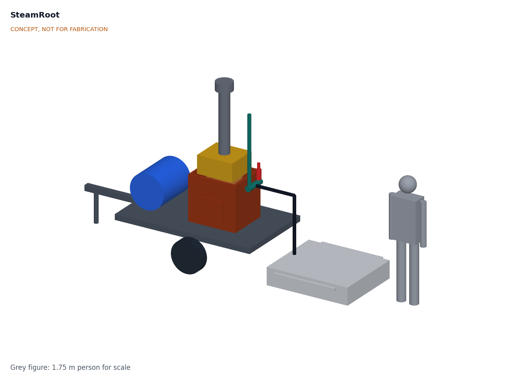

# SteamRoot

  

**Area:** Agriculture · **TRL:** 3 of 9 (analytical proof of concept on paper) · **Prototype budget:** $2,200 USD · **Difficulty:** 5 of 5

Low-pressure, biomass-fired steam generator with a flue-gas economizer and a steam-hood trailer for soil pasteurization, operated near atmospheric pressure to stay out of pressure vessel code.

[Interactive 3D model](media/viewer.html) · [Concept blueprint (PDF)](media/concept-blueprint.pdf) · [General arrangement STR-DWG-002 (PDF)](cad/drawings/STR-DWG-002.pdf) · [Sizing calculations](docs/04-calcs/01-sizing.md) · [Review note](docs/REVIEW.md)

## Concept rationale

Steam is the one soil treatment that kills weed seeds and soil-borne pathogens in hours, in any season, with nothing left behind in the soil. What keeps it away from small growers is the boiler: a pressurized, diesel- or gas-fired vessel that is costly, regulated and dangerous to improvise. SteamRoot removes the pressure instead of managing it. A once-through coil holds about 7 L of water and is always open to the air through a water seal, so there is no drum to rupture, and the fire burns the prunings and scrap wood that most farms already have.

The design is open and garage-buildable because the users are market gardens, nurseries and cooperatives that cannot justify a commercial steamer for a few hundred square meters of beds. Stock steel, stainless tube, a used trailer and certified off-the-shelf safety parts keep it inspectable and repairable, and publishing the calculations lets extension services and local boiler authorities check exactly how it stays near atmospheric pressure.

## Burning platform

Weeds are the costliest pest group in farming: a global review found they cause the highest potential crop loss of any pest group, about 34 % ([Oerke, *Journal of Agricultural Science*, 2006](https://www.cambridge.org/core/journals/journal-of-agricultural-science/article/abs/crop-losses-to-pests/AD61661AD6D503577B3E73F2787FE7B2)). Growers who avoid synthetic herbicides are a large and growing group: certified organic land reached 98.9 million hectares at the end of 2023, managed by 4.3 million producers ([FiBL and IFOAM, *The World of Organic Agriculture 2025*](https://www.fibl.org/en/info-centre/news/organic-market-back-on-track)).

The chemical fallback is closing. Methyl bromide, long the standard soil fumigant, was phased out under the Montreal Protocol; in the United States, California strawberry fields were the last pre-plant use to receive a critical use exemption, for 2016, and no pre-plant use was nominated for 2017 ([US EPA, 80 FR 61985, 2015](https://www.federalregister.gov/documents/2015/10/15/2015-26301/protection-of-stratospheric-ozone-the-2016-critical-use-exemption-from-the-phaseout-of-methyl)). Steam is an effective replacement, but only if its energy cost per square meter comes down.

## Where it could be used

### By industry

| Industry | Use |
| --- | --- |
| Organic market gardening | Clearing weed seed banks from high-value vegetable beds before planting |
| Nurseries and seedling propagation | Pasteurizing potting media and propagation beds against damping-off |
| Greenhouse and polytunnel horticulture | Steaming soil between crops, with the generator kept outside |
| Cut flowers and ornamentals | Soil treatment for field-grown flowers where fumigants are no longer allowed |
| Agricultural extension and research | An open reference design for field days, trials and teaching |
| Community gardens and urban farms | A shared, towable machine for plots too small for contract steaming |

### By country or region

| Country or region | Why it matters there |
| --- | --- |
| United States (California) | High-income strawberry and vegetable growers lost the last pre-plant methyl bromide exemption after 2016 ([US EPA, 2015](https://www.federalregister.gov/documents/2015/10/15/2015-26301/protection-of-stratospheric-ozone-the-2016-critical-use-exemption-from-the-phaseout-of-methyl)) |
| Mexico | Steam has already replaced methyl bromide in the ornamental plant sector, where growers pasteurize media before planting ([UNEP, 2014](https://ozone.unep.org/system/files/documents/Phasing-out%20Methyl%20Bromide%20in%20developing%20countries%20FINAL%20low%20version.pdf)) |
| India | Home to 2.36 million organic producers, more than half the world total ([FiBL, 2025](https://www.fibl.org/en/info-centre/news/organic-market-back-on-track)) |
| Kenya | Substrates replaced methyl bromide in Kenyan rose production; growers who stay in soil, and nursery beds, still need a clean soil treatment ([UNEP, 2014](https://ozone.unep.org/system/files/documents/Phasing-out%20Methyl%20Bromide%20in%20developing%20countries%20FINAL%20low%20version.pdf)) |
| Egypt and Jordan | Methyl bromide phase-out projects there used soil solarization, which needs the hot season; steam works year-round ([UNEP, 2014](https://ozone.unep.org/system/files/documents/Phasing-out%20Methyl%20Bromide%20in%20developing%20countries%20FINAL%20low%20version.pdf)) |

## What sparked the idea

The idea traces back to the Montreal Protocol's phase-out of methyl bromide as a soil fumigant, completed on 1 January 2005 in developed countries and on 1 January 2015 in developing ones. Reviewing that phase-out in 2014, UNEP's Ozone Secretariat called steam "probably the best technical alternative to MB in protected agriculture", but warned that deep in-ground steaming needs so much boiler time, labor and fuel that it "may render steaming an economically unacceptable alternative" ([UNEP, *Phasing-out Methyl Bromide in Developing Countries*, 2014](https://ozone.unep.org/system/files/documents/Phasing-out%20Methyl%20Bromide%20in%20developing%20countries%20FINAL%20low%20version.pdf)). SteamRoot starts from that gap: keep the steam, and cut the boiler cost, the fuel bill and the pressure hazard.

## Problem

Herbicide-free weed and pathogen control by steaming soil works, but the portable boilers that do it are inefficient and diesel-fired.

## Concept

Low-pressure, biomass-fired steam generator with a flue-gas economizer and a steam-hood trailer for soil pasteurization, operated near atmospheric pressure to stay out of pressure vessel code.

Full design precis: [docs/02-concept.md](docs/02-concept.md)

TRL 3 status (paper only): the sizing note [STR-CAL-001](docs/04-calcs/01-sizing.md) finds 30 kg/h of steam at a header pressure of about 0.03 bar with 7 L of water in the heated section, about 1.9 m²/h treated at 15 cm with two hoods, 402 kg as towed with the tank drained, and $1,915 in parts against a $2,200 budget. It still misses the efficiency targets: about 54 % fuel-to-steam against 65 %, and 5.4 kg of wood per m² against 4. A paper study of an evaporator bank in the flue with controlled air is the next step ([STR-DDR-002](docs/decisions/0002-recommendations-accepted.md)). A written ruling from the local boiler authority is an open prerequisite before any detail design or build. TRL 4 work is on hold.

## Key components

- Once-through monotube coil, 25.4 mm 316 stainless
- Fiber-lined firebox
- Economizer coil
- Fixed-rate feed pump with coil outlet and tank level alarms
- Water-seal vent and certified relief valve
- Two steam hoods used alternately
- Thermocouples

The working bill of materials is in [bom/bom.csv](bom/bom.csv).

## Safety

> This design involves open fire, carbon monoxide and steam. Keep operating pressure and water volume below local boiler and pressure vessel code thresholds, get a written ruling from the local boiler authority before any build, fit a certified relief valve, and never operate it unattended.

## Repository layout

| Folder | Contents |
| --- | --- |
| `docs/` | Problem, concept, requirements, calculations and design decisions |
| `cad/src/` | build123d Python source, the source of truth for all geometry |
| `cad/step/`, `cad/stl/` | Exported models for FreeCAD, other CAD tools and printing |
| `cad/drawings/` | 2D sketches and dimensioned drawings |
| `bom/` | Bill of materials |
| `electronics/` | KiCad schematics and PCB layouts |
| `firmware/` | Microcontroller code |
| `media/` | Renders, perspectives and photos |
| `build-log/` | Dated prototyping notes |

## Documentation

Controlled documents follow the portfolio [documentation standard](.kit/STANDARDS.md). Each carries a document ID (STR-PRC-001 for the precis), a version and a revision history. Branded PDFs are built with `python .kit/render.py` and attached to GitHub Releases when a document is tagged, for example `STR-PRC-001/v1.0`.

## Licenses

- **Hardware** (CAD, drawings, BOM, electronics): [CERN-OHL-S v2](LICENSE)
- **Software** (firmware, scripts, notebooks): [MIT](LICENSE-SOFTWARE)

A project of the [Design Molecule](https://designmolecule.com) lab.
