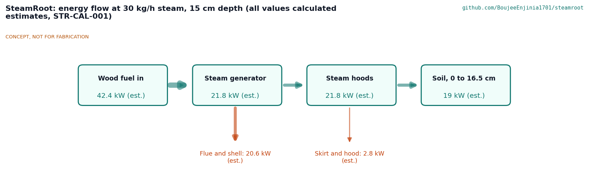
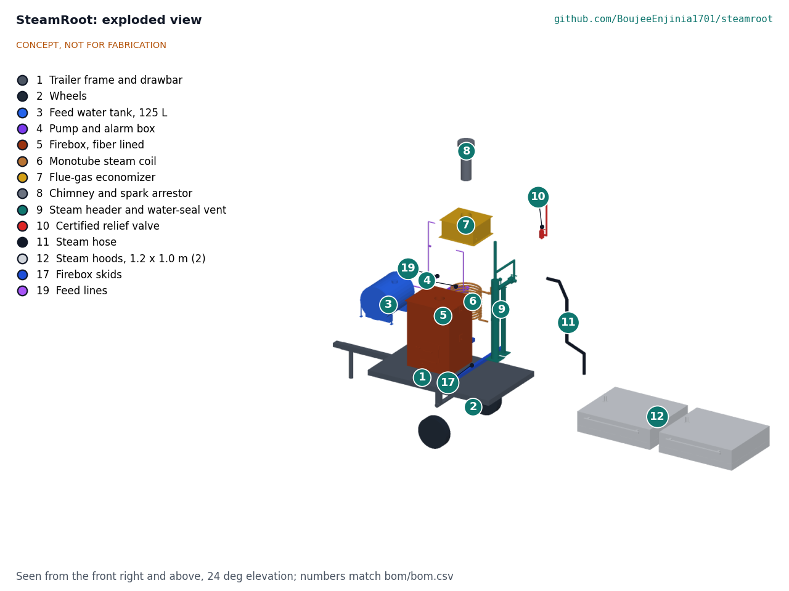
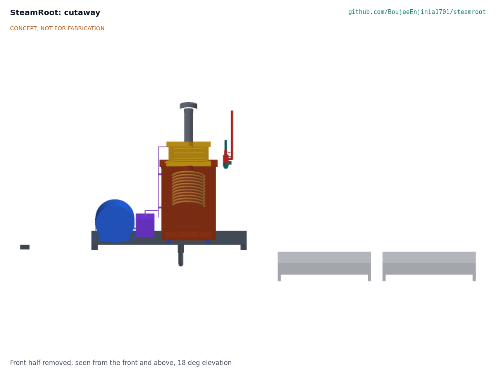

# SteamRoot design precis

SteamRoot is a towable, wood-fired steam generator that never holds pressure. A pump pushes water once through a large-bore stainless coil above the fire, the steam flows at close to atmospheric pressure through a hose to one of two insulated hoods pressed onto the soil, and a flue-gas economizer preheats the feed water. The TRL 3 calculation (STR-CAL-001) confirms the core safety idea on paper: 30 kg/h of steam with under 7 L of water in the heated section and a header pressure of about 0.03 bar. With the requirements as restated by Amish on 2026-09-25 (STR-DDR-002), the concept still misses two efficiency targets: about 51 % fuel-to-steam efficiency (target 65 %) and 5.6 kg of wood per m² at 15 cm (target 4). It treats about 1.9 m²/h at 15 cm with two hoods and weighs 468 kg as towed with the tank drained. Value-engineering target: USD 2,200. Estimated cost of the constructable design: USD 2,275 (USD 75 over the target). The design was made constructable on 2026-10-01 (STR-DDR-003, open for Amish's review); the prototype build plan is [docs/05-build-plan.md](05-build-plan.md) and open decisions are in [docs/06-design-decisions.md](06-design-decisions.md).

> **Safety:** SteamRoot is a concept for review, not a design to build. It combines open fire, carbon monoxide, and steam that causes severe burns in under a second. Local boiler and pressure vessel rules may apply even at low pressure. **A written ruling from the local boiler authority is an open prerequisite:** Amish approved getting it before TRL 3 detail work, and it has not been obtained. See the Safety section before any further work.

*Figure 1. TRL 3 model in the working position: trailer, generator and two hoods on a bed, next to a 1.75 m person.*

## How it works

1. **Feed.** A 12 V diaphragm pump draws water from a 125 L tank and meters 0.5 L/min (30 kg/h) into the economizer at a fixed rate. A float switch warns when the tank runs low.
2. **Preheat.** The economizer coil sits in the flue gas above the firebox and warms the feed water from about 15 °C to about 85 °C.
3. **Boil.** The warm water enters the bottom of a monotube coil that sits above the fire bed inside the fiber-lined firebox, on three brackets, with the door, grate and air inlet below it. It boils as it rises through 11 turns and leaves the top of the coil as steam. The coil holds under 6 L of water. A thermocouple on the coil outlet sounds an alarm if the outlet overheats, which is the sign of a coil running dry.
4. **Vent and separate.** The coil discharges into a steam header 1.55 m above the ground. The header is always open to the atmosphere through a water-seal pot: a dip leg reaches 890 mm below the water line, and the water it displaces rises 110 mm outside it, so steam can only build about 0.094 bar gauge (1 m of water) before it bubbles through the seal and out of a vent pipe that ends 2.3 m above the ground, above head height. The seal cannot stick or be adjusted, and it is never valved off. A certified relief valve on the header is the second line of protection.
5. **Deliver.** Steam flows through a 6 m, 25 mm steam hose to a hood. A three-way diverter at the header sends steam to the hose or to the vent and has no closed position.
6. **Pasteurize.** Each hood is a 1.2 x 1.0 m insulated open-bottom pan with a 60 mm soil skirt. Steam from a perforated manifold condenses in the soil and drives a hot front downward. While one hood heats, the other holds its soil at temperature. To change over, the operator diverts steam to the vent, moves the hose coupling to the other hood and diverts steam back.

*Figure 2. Energy flow at the design point of 30 kg/h of steam and 15 cm depth. All values are calculated estimates from STR-CAL-001.*

## Main components

Item numbers match the exploded view, the general arrangement drawing STR-DWG-002 and `bom/bom.csv`. Items 13 to 16 are not drawn.

*Table 1. Main components.*

| # | Component | Choice | Notes |
| --- | --- | --- | --- |
| 1 | Trailer frame and drawbar | Used single-axle garden or utility trailer, deck 2.0 x 1.2 m | Rated 750 kg or more |
| 2 | Wheels | Trailer wheels, about 460 mm diameter | Included with the trailer |
| 3 | Feed water tank | 125 L HDPE drum with strainer and sight tube | 4.2 h of steaming |
| 4 | Feed pump | 12 V diaphragm pump with needle valve and flow meter | Its 3 bar shut-off pressure also caps coil inlet pressure if the coil blocks |
| 5 | Firebox | 700 x 600 x 1000 mm steel box on two skids, bolted roof, 50 mm ceramic fiber lining, grate on a stand, latched door, air damper | About 42 kW firing. A castable lining would add about 280 kg |
| 6 | Monotube steam coil | 316 stainless tube, 25.4 mm OD x 1.65 mm wall, 14.5 m in 11 turns on 420 mm | Decided by Amish, 2026-09-25 |
| 7 | Flue-gas economizer | 8 m of 12.7 mm stainless tube in a box above the firebox, with condensate drain | Flue condensate is acidic (dew point about 45 °C) |
| 8 | Chimney and spark arrestor | 150 mm flue, outlet 2.4 m above ground, 6 mm mesh | Keeps flue gas above head height |
| 9 | Steam header and water-seal vent | DN50 header at 1.55 m on a post, 114 mm seal pot with a 1 m effective seal, vent to 2.3 m, three-way diverter with a vent line, quick coupling | Primary pressure limit. Decided by Amish, 2026-09-25 |
| 10 | Certified relief valve | ASME Section IV steam safety valve, 15 psi (1.03 bar) set, 3/4 in, rated 170 kg/h (375 lb/h) | Secondary protection only; sized for the dry-coil refeed flash (decided by Amish, 2026-09-25) |
| 11 | Steam hose | EPDM saturated-steam hose, 25 mm bore, 6 m, ground-joint couplings, whip checks | Steam rated, not hot-water rated |
| 12 | Steam hoods (2) | 1.2 x 1.0 x 0.25 m aluminum double-skin pans, 40 mm mineral wool, soil skirt, handles on standoffs | Two hoods used alternately. Decided by Amish, 2026-09-25 |
| 13 | Battery | 12 V 20 Ah sealed lead acid | Not drawn |
| 14 | Instruments | Steam gauge, four type K thermocouples and reader | Soil probes at 15 cm; not drawn |
| 15 | Safety kit | Personal CO alarm, fire extinguisher, gloves, face shield | Not drawn |
| 16 | Feed and coil alarms | Coil outlet temperature alarm, tank low-level switch | Decided by Amish, 2026-09-25; not drawn |

*Figure 3. Exploded view with item numbers matching the BOM.*

## TRL 3 numbers

All values come from STR-CAL-001 (`docs/04-calcs/01-sizing.md`, script `docs/04-calcs/sizing.py`). They are paper estimates; none is tested.

*Table 2. Key results.*

| Quantity | Value | Requirement |
| --- | --- | --- |
| Steam output | 30 kg/h, firing 42.4 kW, firebox gas 520 °C | R3 met |
| Heat into the water | 21.78 kW (coil 19.34 kW, economizer 2.44 kW) | |
| Fuel to steam efficiency | 51.4 % (range 42 % to 56 % at λ = 2.0 to 2.5 with F = 0.40 to 0.60; see STR-CAL-001, Table 5) | R5 not met; target kept |
| Stack temperature | 451 °C (262 °C would be needed for 65 %) | |
| Wood use | 10.5 kg/h at 14.5 MJ/kg | |
| Steam per m² at 15 cm | 15.6 kg/m² (front to 16.5 cm) | |
| Treatment rate, two hoods | 1.88 m²/h at 15 cm; 3.41 m²/h at 5 cm | R2 at risk (restated to about 1.9 and 3.4 m²/h) |
| Wood per m² at 15 cm | 5.6 kg/m² | R4 not met; target kept |
| Header pressure, normal | 0.033 bar gauge | R6 met (0.1 bar at the header) |
| Coil inlet pressure, normal | 0.108 bar gauge | R6 met (0.15 bar at the coil inlet) |
| Water seal limit | 0.094 bar gauge | R6 open vent met by design |
| Water in heated section, flooded | 6.93 L | R7 met |
| Steaming per fill | 4.2 h | R8 met |
| Relief valve orifice needed | 6.2 mm at 30 kg/h; 14.1 mm for a dry-coil refeed flash (155 kg/h); 3/4 in valve rated 170 kg/h | R9 met on paper |
| Chimney outlet, hood outer skin | 2.4 m; 23 °C | R10 met |
| Mass as towed, tank and seal drained | 468 kg (602 kg with a full tank) | R11 met |
| Overall width | 1.48 m | R11 at risk |
| Parts cost | USD 2,275 | USD 75 over the USD 2,200 value-engineering target |

The main performance gap is heat transfer. One coil in the firebox takes heat mostly by radiation, and the flue gas leaves the economizer at about 450 °C. The economizer cannot help much because 30 kg/h of feed water can absorb only about 3 kW before it boils. Amish decided on 2026-09-25 to keep the 65 % target and to study a convective evaporator bank in the flue with controlled primary and secondary air. The paper study in STR-CAL-001, section 4, finds that about 4.3 m of 25.4 mm tube in the flue reaches 65 % at λ = 2.0, and about 1.3 m at λ = 1.5. A combustion air preheater alone reaches about 60 %. Even at 65 %, wood use is 4.4 kg/m², so R4 needs about 72 %. The bank is not yet in the model; it is the subject of the next paper iteration, which must also keep the heated water volume within R7.

The second gap is steam per square meter. Soil behind the steam front sits at 100 °C, not 75 °C, and the front must go 1.5 cm past the working depth to hold 70 °C through the hold. In soils finer than sand, the steam cannot be pushed through 16.5 cm of soil at full flow without lifting a 29 kg hood, so real rates may be lower still.

*Figure 4. Cutaway showing the helical coil above the fire bed inside the fiber-lined firebox, and the open-bottom hoods with their soil skirts.*

## Key design choices

- **Open-vented, never sealed.** The steam side is always open to the atmosphere through the water-seal pot and vent. There is no isolating valve between the coil and the vent, and the diverter can only send steam to the hose or the vent, never close both. Decided by Amish, 2026-09-25.
- **Monotube coil instead of a drum boiler.** A once-through coil holds under 6 L of water, so a failure releases little stored energy. The cost is careful feed control: too little water dries the coil. Decided by Amish, 2026-09-25.
- **Large-bore stainless coil (25.4 mm, 316).** A 12.7 mm coil would need more than 2 bar at its inlet. The 25.4 mm coil keeps the header near 0.03 bar, though the inlet is at about 0.11 bar. Stainless tolerates a dry-fire event far better than copper. Decided by Amish, 2026-09-25.
- **Hood steaming with two hoods used alternately.** Decided by Amish, 2026-09-25. One hose is moved between the hoods with a steam-rated coupling after steam is diverted to the vent. A second hose and a three-outlet diverter would avoid handling the hose but add at least $180. One hose: decided by Amish, 2026-09-25 (STR-DDR-002).
- **Tow drained, fill on site.** The machine is towed with the feed tank and seal pot drained (468 kg) and filled from a water supply at the site. Decided by Amish, 2026-09-25 (STR-DDR-002).
- **Relief valve sized for the refeed flash.** The 3/4 in, 15 psi valve is rated 170 kg/h, above the 155 kg/h a dry-coil refeed could produce. Decided by Amish, 2026-09-25 (STR-DDR-002).
- **Feed control.** Fixed pump rate with a coil outlet temperature alarm and a tank low-level alarm. Decided by Amish, 2026-09-25.
- **Fiber lining, not castable.** A 50 mm ceramic fiber lining keeps the firebox near 125 kg; castable refractory would make it about 406 kg and break R11. Fiber is less robust against loading damage. Fiber lining: decided by Amish, 2026-09-25 (STR-DDR-002).
- **Wood only.** Split wood or chips at 20 % moisture or drier, batch-fed by hand. No liquid fuel backup. Decided by Amish, 2026-09-25 (STR-DDR-002).

## Safety

SteamRoot is the highest-risk concept in the portfolio. Every later stage must keep this section and extend it.

> **Safety: regulatory ruling first.** A written ruling from the local boiler authority on this open-vented, fired monotube coil is an open prerequisite. No detail design, build or firing may happen before it, and its ruling overrides this document if it is stricter.

> **Safety: never sealed.** The steam side must always be open to the atmosphere through the water-seal vent. Never fit a valve, cap or plug that can isolate the coil or header from the vent. Keep the seal pot filled to its mark; an empty seal pot is an open vent, but an overfilled or frozen one raises the relief pressure. Never plug, adjust or remove the relief valve. A sealed coil or tank over a fire can rupture violently.

> **Safety: certified relief valve.** Fit only a certified, code-stamped steam safety valve sized for the full steam output. It is a second line of protection behind the open vent, not a replacement for it. Test it by its lever as the maker directs.

> **Safety: local boiler rules.** Many jurisdictions regulate steam generators by pressure, heating surface, water volume or firing rate, and some regulate all fired steam equipment. The low-pressure design is intended to stay below common thresholds, but this is unconfirmed. Confirm with the local boiler inspector or authority before any build, and follow their ruling even if it is stricter than this document.

> **Safety: steam burns.** Steam at 100 °C releases its latent heat on skin and causes deep burns within a second. Divert steam to the vent before lifting a hood or moving the hose coupling. In fine soils steam may jet from under the hood skirt, because the soil resists steam flow more than the hood's weight can hold (STR-CAL-001, section 2). Keep hands and feet clear of the skirt and the vent outlet. Wear heat-resistant gloves, a face shield, long sleeves and closed boots. Keep bystanders, children and animals at least 5 m away. Use a steam-rated hose with a whip check, and inspect it before every use.

> **Safety: dry coil.** If the feed pump stops or the tank runs dry, the coil heats toward the firebox gas temperature (about 520 °C) while the fire keeps burning. Refeeding it could flash about 1.3 kg of water at about five times the design steam flow, more than the vent path is sized for. Never restart the feed into a hot, dry coil. Close the air damper, let the fire die and let the coil cool first. The coil outlet alarm and the tank low-level alarm exist to catch this early.

> **Safety: fire.** Operate only on bare ground or gravel, clear of dry vegetation, with a fire extinguisher and water at hand. The spark arrestor must be fitted; the flue leaves at about 450 °C. Do not operate during fire bans or in high wind. Never leave a lit firebox unattended, and let it burn out fully before towing.

> **Safety: carbon monoxide.** Wood fires produce carbon monoxide, which is odorless and deadly. The firebox and chimney must stay outdoors. Steam may be piped into a greenhouse or polytunnel, but the generator may not. The operator wears a personal CO alarm. Never refuel or tend the fire from downwind in the smoke.

> **Safety: hot surfaces and water quality.** The firebox skin reaches about 100 °C, and the chimney, economizer, header, seal pot and hood inner skin reach burn temperatures. Use rain water or softened water to limit scale in the coil; scale raises tube temperature and can block the coil.

- **Soil biology.** Steaming kills beneficial organisms as well as pests, and the soil behind the steam front reaches 100 °C. Overheating soil can release manganese and ammonium that harm seedlings. Do not steam longer than needed.
- **Towing.** Tow only with the fire out, the tank and seal pot drained, and the hoods strapped down. Towing with a full tank puts the mass at about 602 kg, over the 500 kg limit in R11.

## Open questions

These are tracked, with options and recommendations, in the design decisions register STR-DEC-001 ([docs/06-design-decisions.md](06-design-decisions.md)).

- Regulatory status of an open-vented, fired monotube coil in Amish's home jurisdiction. Open prerequisite; gates all further work.
- R5 and R4: decided by Amish, 2026-09-25, to study a convective evaporator bank with controlled primary and secondary air and keep the targets. The first paper study is in STR-CAL-001; the next iteration must add the bank to the model and check R6, R7 and R11.
- What soil permeability and skirt leakage do real beds show, and does the hood need ballast? This decides R1 and R2 and cannot be settled on paper.
- Where do two hoods ride during towing? The deck behind the firebox is too short for them.
- How is the seal pot level kept up as steam condenses in it and bubbles through it, and how is it protected from freezing?
- How much does starting soil moisture change steam demand? Wet soil needs more energy but conducts heat better.

Concept media: [blueprint sheet](../media/concept-blueprint.pdf), [interactive 3D model](../media/viewer.html). General arrangement: [STR-DWG-002](../cad/drawings/STR-DWG-002.pdf).
