# SteamRoot prototype build plan

**Plan, not yet built.** How to build the first proof-of-concept prototype, component by component. Building and testing to it is TRL 4 work. Decisions still to be made are kept in the design decisions register ([docs/06-design-decisions.md](06-design-decisions.md)), not here.

> **Safety:** Nothing in this plan may be bought, built or fired until there is a written ruling from the local boiler authority on this open-vented, wood-fired steam coil (safety stop S1). SteamRoot combines an open fire, carbon monoxide and steam that burns skin in under a second. The steam side must always be open to the air through the water-seal vent: never fit a valve, cap or plug that could shut it. Welding, grinding and cutting ceramic fibre each have their own hazards, given in section 6.

## 1. What you are building

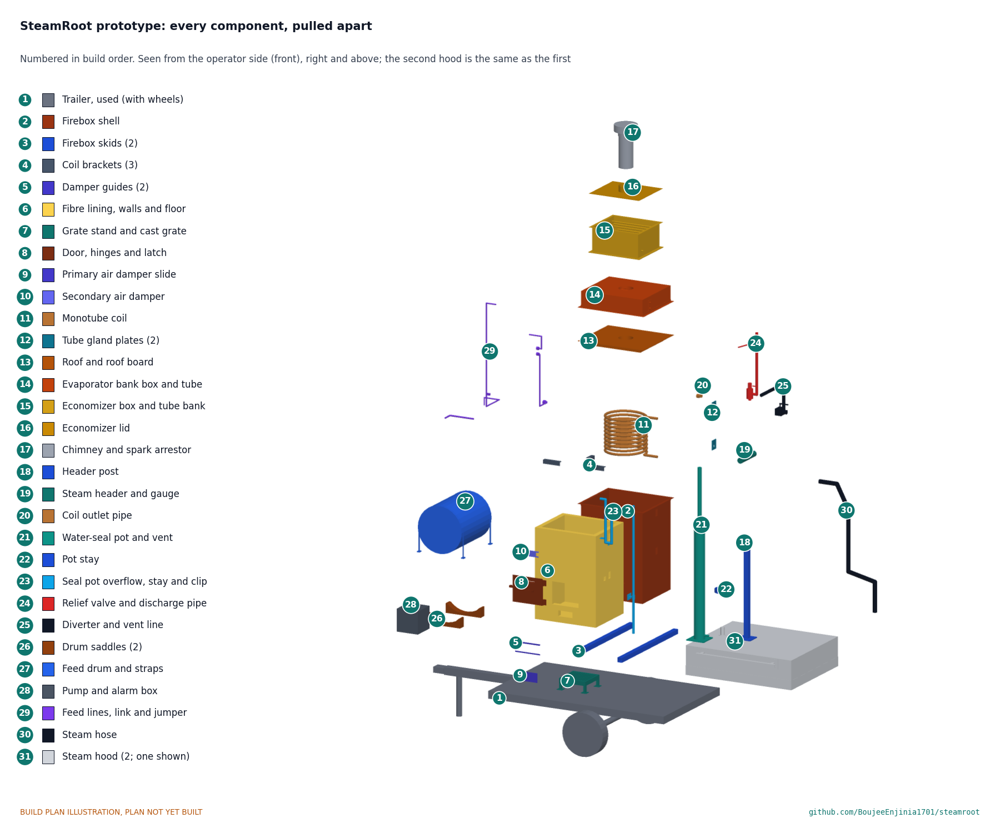

*Figure 1. Every component pulled apart and numbered in build order; the second hood is the same as the first.*

The prototype is a small wood-fired steam generator on a used single-axle trailer, with two insulated steam hoods that are pressed onto a soil bed. On the trailer stand a lined steel firebox with a stainless steel coil above the fire and two air dampers, an evaporator bank box, a flue-gas economizer and a chimney stacked on the firebox roof, a steam header on a post with its water-seal pot, overflow, vent, relief valve and diverter, a feed water drum on two saddles, and a box holding the feed pump, battery and alarms. A 6 m steam hose takes the steam to whichever hood is in use. Figure 1 shows the 31 components in the order you make or fit them. Most are made in a farm or small fabrication workshop: the firebox shell, roof, skids, brackets, grate stand, door and dampers are cut and welded from mild steel sheet, tube and angle; the coil and the evaporator bank are each bent from one length of stainless tube; the bank box, the economizer box and its tube bank, the header, seal pot, overflow and post are made from sheet, pipe and tube; the hoods are folded and riveted from aluminium and galvanised sheet. Everything else is bought: the trailer, the ceramic fibre lining, the cast grate, the chimney and spark arrestor, the certified relief valve, the diverter, the hose, the drum, the pump and the alarms. The parts cost about $2,600 from the bill of materials.

## 2. What changed to make it buildable

The concept showed what SteamRoot does; some of its parts could not be made, fixed or put together as drawn. Each change below keeps what the machine does, and all of them are recorded in decision record STR-DDR-003, accepted by Amish on 2026-10-02.

*Table 1. Changes from the concept.*

| Component | The concept had | The buildable design has | Why |
| --- | --- | --- | --- |
| Firebox and coil | A 650 mm firebox with the coil wound round the fire from near the floor to the roof; nowhere to load wood | A 960 mm firebox with the door, grate and air inlets below the coil and 280 mm of fire space (Figure 9) | Wood has to go in through a door onto a grate the coil does not surround |
| Coil support | None | Three stainless brackets welded to the shell through the lining (Figure 6) | The coil rests on them and can grow when hot |
| Coil fitting | A welded box the coil could not enter; tails through the wall with no holes, crossing outside | A bolted roof; the coil goes in from the top and its tails slide out through slots closed by gland plates; unions outside (Figure 15) | The coil can be fitted, removed and allowed to grow |
| Economizer | A solid box, not fixed, with the coil inlet ending beside it | A bolted box on the roof with a serpentine tube bank inside, a lid carrying the chimney, and unions to the feed line and, through the evaporator bank, the coil (Figure 18) | The feed water has a path from the pump to the coil |
| Firebox fixing | Standing loose on the deck | Two skids welded under the firebox, bolted into the trailer's side rails (Figure 4) | Held for towing, with an air gap under the hot floor |
| Water-seal pot | Reached through the deck; a 1 m dip leg that would have let the header reach about 0.11 bar | A pot on a foot plate with an 890 mm dip leg and an overflow at the water mark, so the seal blows at 0.084 bar and the pot cannot be overfilled (Figure 25) | Keeps the seal under the 0.094 bar limit and keeps water out of the vent |
| Header | Hung on the coil tube | A post with a saddle and U-bolts, and a stay to the pot (Figure 22) | The coil is not a structure |
| Diverter, relief valve | No pipe from the diverter to the vent; relief valve with no discharge pipe | A vent line from the diverter into the vent pipe; a relief discharge pipe to 2.3 m (Figure 22) | Steam always has a safe way out |
| Hose and hood | The hose passed through the deck and the hood; the manifold floated | A coupling on top of each hood, a riser to the hung manifold, a riveted skirt (Figure 32) | Every joint is made, not drawn through |
| Drum and feed | A cradle cut through the drum; no feed lines | Two hardwood saddles, ratchet straps, a suction hose and a stainless feed line (Figure 28) | The drum is held for towing and the water reaches the coil |

## 3. Making the components

Make and check each component before the assembly step that needs it. Sizes are in millimetres. "Front" is the operator side, where the firebox door is; "left" and "right" are as seen standing at the front facing the machine, so the drawbar is on the left and the hoods on the right. Heights are above the ground with the trailer level unless a step says otherwise. Workshop tolerance is 1 mm on steelwork and 0.5 mm on drilled holes unless a step says otherwise; drawings do not carry tolerances before TRL 4.

### 3.1 Trailer (bought, used)

**What it is.** A used single-axle garden or utility trailer with a flat deck about 2.0 x 1.2 m, about 500 above the ground, with steel side rails about 80 deep, rated for 750 kg or more.

**What to do to it.** Clean and check the deck, the side rails, the axle, the tyres, the lights and the coupling, and repair anything worn. Mark the deck centre line. Drill the holes for the skids (section 3.3), the header post and pot foot plates (sections 3.15 and 3.17), the drum saddles (section 3.19) and the pump box (section 3.23) once those parts are made, by marking through them in place.

**Check before moving on.** The trailer stands level on its jack; the axle rating on its plate covers 602 kg.

### 3.2 Firebox shell

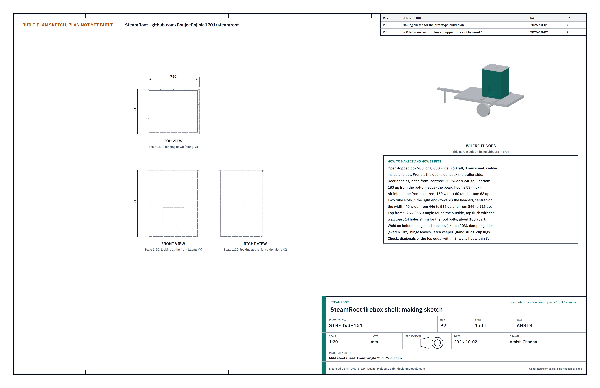

*Figure 2. Firebox shell making sketch (STR-DWG-101).*

**What it is and what it is made from.** The steel box that holds the lining, the grate and the coil. Mild steel sheet 3 mm, welded, open at the top, 700 long, 600 wide and 960 tall, with a frame of 25 x 25 x 3 mm angle round the top edge for the roof bolts.

**How to make it.**

1. Cut the floor 700 x 600, the front and back 700 x 957 and the two ends 594 x 957 from 3 mm sheet. Mark the inside faces.
2. In the front, cut the door opening 300 wide x 240 tall, centred, its bottom 183 above the bottom edge of the box, and the air inlet 160 wide x 60 tall, centred, its bottom 68 above. Round the corners to about 5 and file the edges.
3. In the right end, cut the two tube slots 40 wide, centred on the width: one from 446 to 516 above the bottom edge, the other from 846 to 916.
4. Tack the walls to the floor and to each other, check the box is square (diagonals of the top within 3), then weld all seams inside and out.
5. Weld the 25 x 25 x 3 angle frame round the outside of the top edge, mitred at the corners, its top flush with the wall tops. Drill 14 holes of 9 mm through the frame, 12.5 out from the walls: five along each long side and two more at each end, evenly spaced.
6. Weld on, before the lining goes in: the coil brackets inside (section 3.4); the damper guides, the hinge leaves and the latch keeper outside on the front (sections 3.7 and 3.8); four M6 studs round each tube slot (section 3.10); two clip lugs on the left end for the feed line, 190 behind the centre line, 400 and 850 above the bottom edge.
7. Fit stainless lining pins on the inside walls about 250 apart (section 3.5). Paint the outside with high-temperature paint.

**How it fits the parts next to it.** The floor sits on two skids (Figure 4). The roof bolts down onto the angle frame (section 3.11). The evaporator bank box and the economizer stand on the roof, not on the shell.

**Check before moving on.** The walls are flat within 3; the door opening and slots are where Figure 2 shows; a 40 mm bar passes freely through each slot.

### 3.3 Firebox skids (make 2)

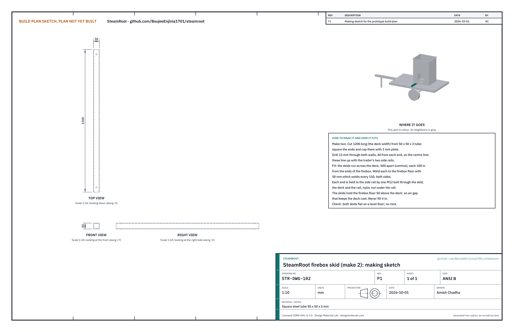

*Figure 3. Firebox skid making sketch (STR-DWG-102).*

**What it is and what it is made from.** Two lengths of square tube that run across the deck under the firebox; their ends bolt into the trailer's side rails. Square steel tube 50 x 50 x 3 mm.

**How to make it.**

1. Cut two lengths of 1200 (the deck width); square the ends and weld a 3 mm cap on each.
2. Drill 13 mm through both walls, 40 from each end, on the centre line.
3. Turn the firebox over. Lay the skids across its floor, 500 apart (centres), each 100 in from an end, overhanging equally front and back. Stitch weld each to the floor, 50 long every 150, on both sides.

**How it fits the parts next to it.**

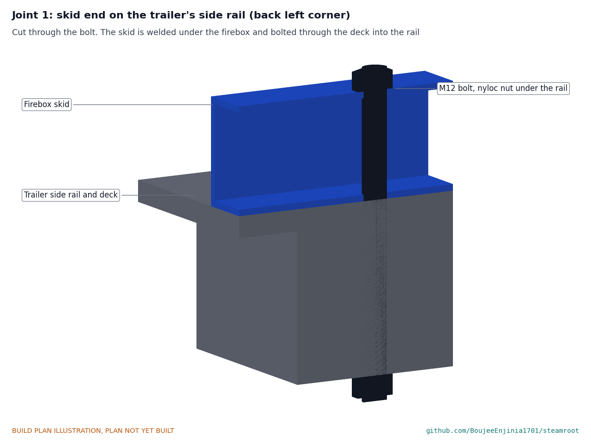

*Figure 4. Each skid end is held by one M12 bolt through the skid, the deck and the side rail, with a nyloc nut under the rail.*

The skids hold the firebox floor 50 above the deck. That air gap keeps the deck cool: never fill it.

**Check before moving on.** The firebox stands on a level floor on its skids without rocking.

### 3.4 Coil brackets (make 3)

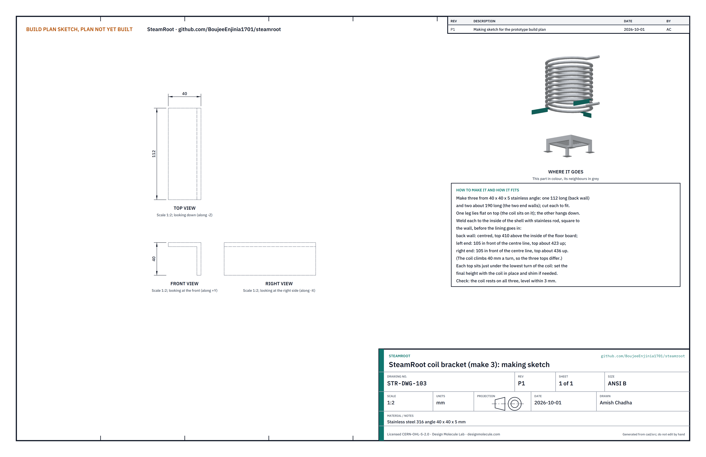

*Figure 5. Coil bracket making sketch (STR-DWG-103).*

**What it is and what it is made from.** Three short angles welded inside the firebox that carry the lowest turn of the coil. Stainless steel 316 angle 40 x 40 x 5 mm.

**How to make it.**

1. Cut one 112 long and two about 190 long; deburr.
2. Weld each to the inside of the shell with stainless rod (309 type for stainless to mild steel), the flat leg on top and the other leg hanging down: the short one in the middle of the back wall, its top 410 above the inside of the floor board (463 above the bottom of the shell); one on each end wall, 105 in front of the centre line, tops about 423 (left) and 436 (right) above the floor board. The coil climbs 40 mm a turn, so the three tops differ.
3. Set the final heights with the coil in place (step 7) and shim under the coil if needed.

**How it fits the parts next to it.**

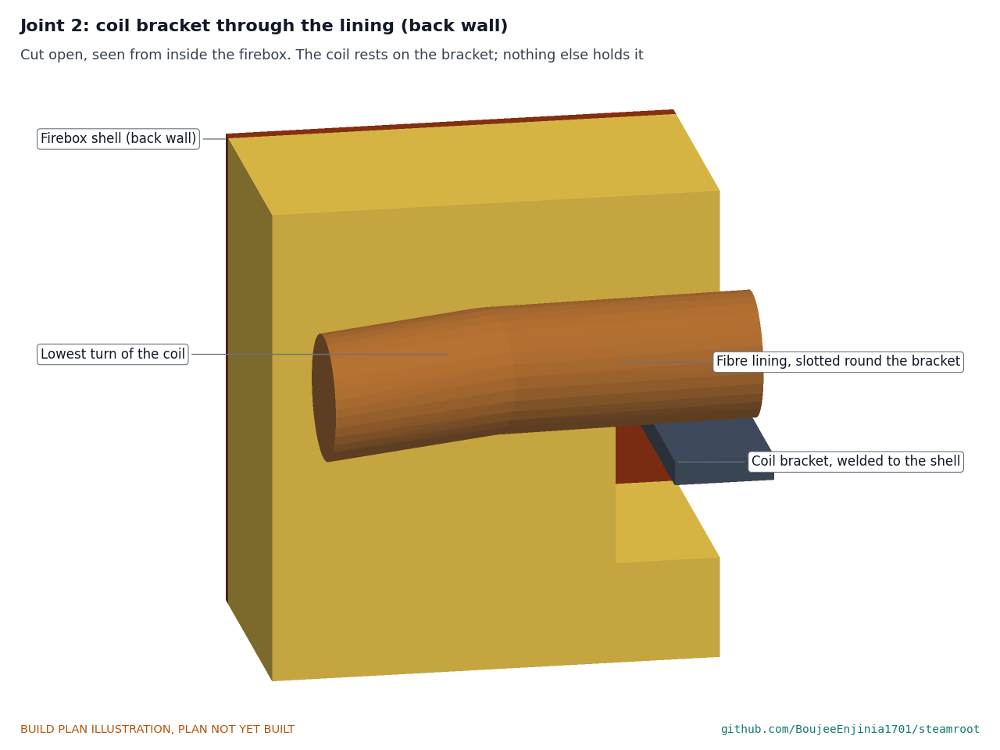

*Figure 6. The bracket passes through a slot in the lining; the lowest turn of the coil rests on it. Nothing else holds the coil.*

**Check before moving on.** All three brackets are level across and square to their walls.

### 3.5 Fibre lining (bought, cut to fit)

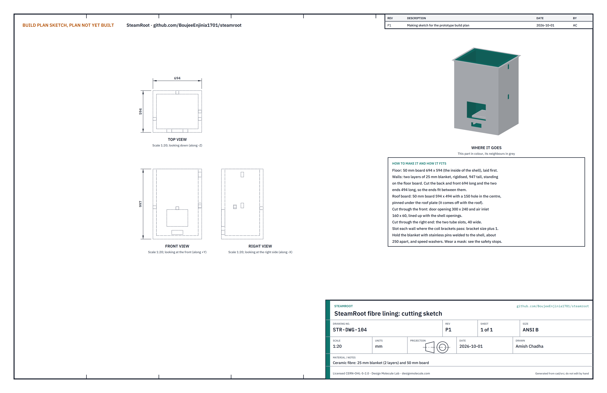

*Figure 7. Fibre lining cutting sketch (STR-DWG-104).*

**What it is and what it is made from.** The insulation inside the firebox: 50 mm ceramic fibre board on the floor and under the roof, and two layers of 25 mm rigidised ceramic fibre blanket on the walls.

**How to make it.**

1. Cut the floor board 694 x 594 and lay it in first.
2. Cut each layer of wall blanket 907 tall: the back and front 694 long, the two ends 494 long so they fit between them. Cut through the front for the door opening (300 x 240) and air inlet (160 x 60), and through the right end for the two tube slots, each lined up with the shell. Slot the blanket where the brackets pass (bracket size plus 1).
3. Press each layer over the pins, the joints of the second layer staggered from the first, and hold it with speed washers. Brush on rigidizer.
4. Cut the roof board 594 x 494 with a 150 hole in the centre; it goes on the roof (section 3.11).

**How it fits the parts next to it.** The walls stand on the floor board; the roof board fits inside the tops of the walls (Figure 18).

**Check before moving on.** No steel shows inside except the bracket tops and the pins; the lining is 50 thick everywhere.

### 3.6 Grate stand and cast grate

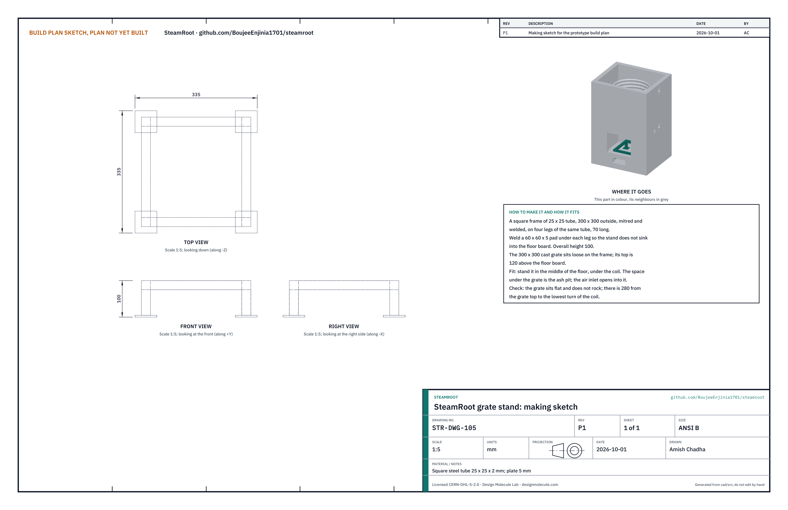

*Figure 8. Grate stand making sketch (STR-DWG-105).*

**What it is and what it is made from.** A small table that holds the cast grate 100 above the floor, so air comes in under the fire. Square steel tube 25 x 25 x 2 mm and 5 mm plate; a bought 300 x 300 cast iron grate.

**How to make it.**

1. Cut four lengths of 300 with mitred ends and weld them into a square frame 300 x 300 outside.
2. Cut four legs 70 long and weld one under each corner; weld a 60 x 60 x 5 pad under each leg.
3. Check the grate sits flat on the frame.

**How it fits the parts next to it.**

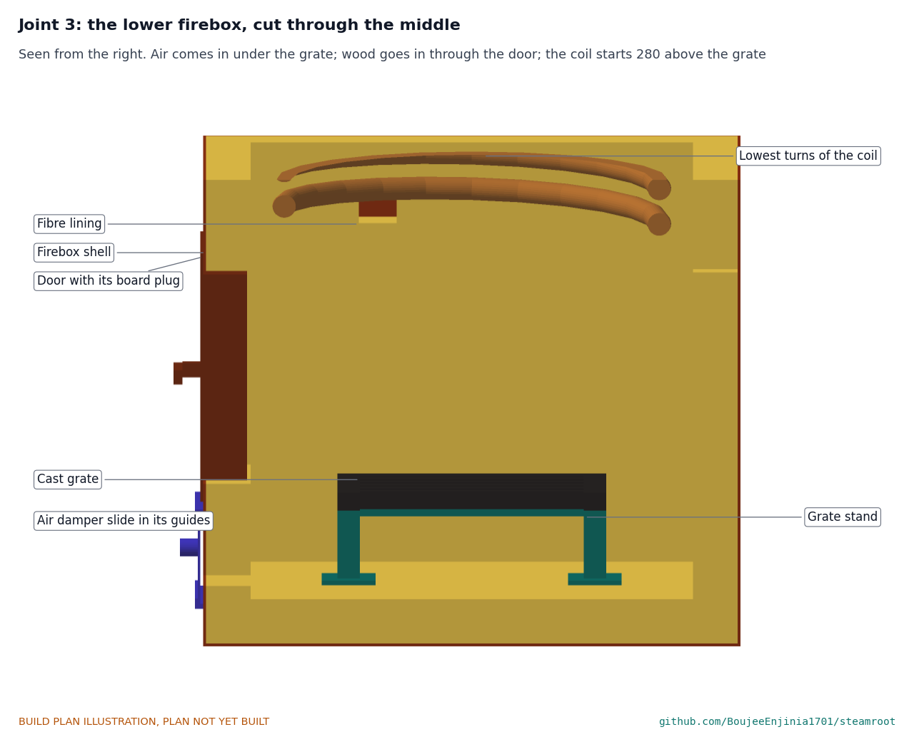

*Figure 9. The stand sits on the floor board in the middle of the firebox, under the coil. The air inlet opens into the ash pit under the grate; the door opening is level with the fire; the coil starts 280 above the grate.*

**Check before moving on.** The grate sits flat and does not rock; there is 280 from the top of the grate to the lowest turn of the coil.

### 3.7 Firebox door

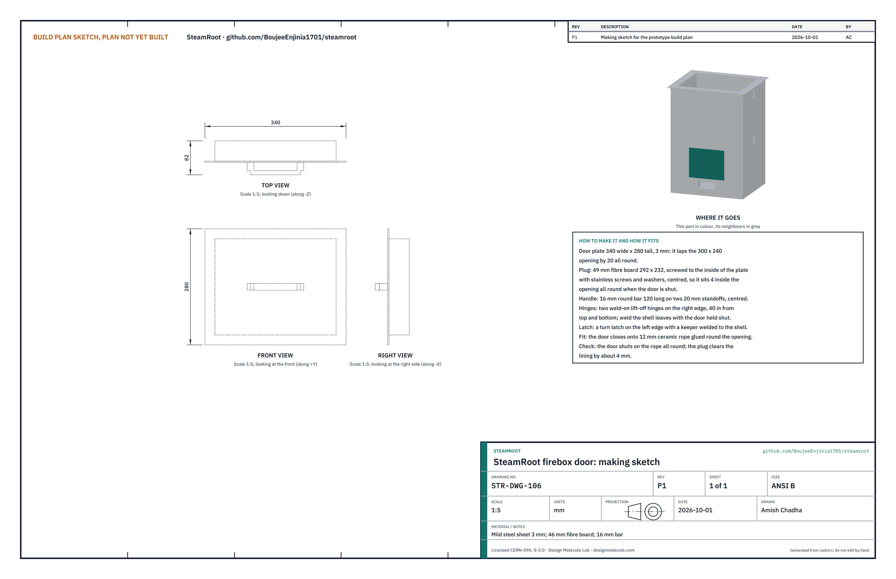

*Figure 10. Firebox door making sketch (STR-DWG-106).*

**What it is and what it is made from.** The door wood is loaded through, with a fibre board plug that fills the opening in the lining. Mild steel sheet 3 mm, 49 mm fibre board, 16 mm round bar, two weld-on lift-off hinges and a turn latch.

**How to make it.**

1. Cut the door plate 340 wide x 280 tall; it laps the opening by 20 all round.
2. Cut the plug from fibre board, 292 x 232 x 49, and screw it to the inside of the plate, centred, with stainless screws and large washers. It sits 4 inside the opening all round.
3. Weld a 120 handle of 16 mm bar on two 20 mm standoffs, centred on the front.
4. Cut the secondary air slot, 150 wide x 20 tall, through the plate and the plug, centred, its bottom 200 above the bottom edge of the plate, so it opens above the fire bed. Its slide is in section 3.27.
5. Weld the door leaves of the two hinges to the right edge of the door, 40 in from top and bottom. Hold the door shut in place and weld the shell leaves to the shell.
6. Fit the turn latch on the left edge of the door and weld its keeper to the shell.
7. Glue 12 mm ceramic rope round the opening on the shell, where the door plate closes.

**How it fits the parts next to it.**

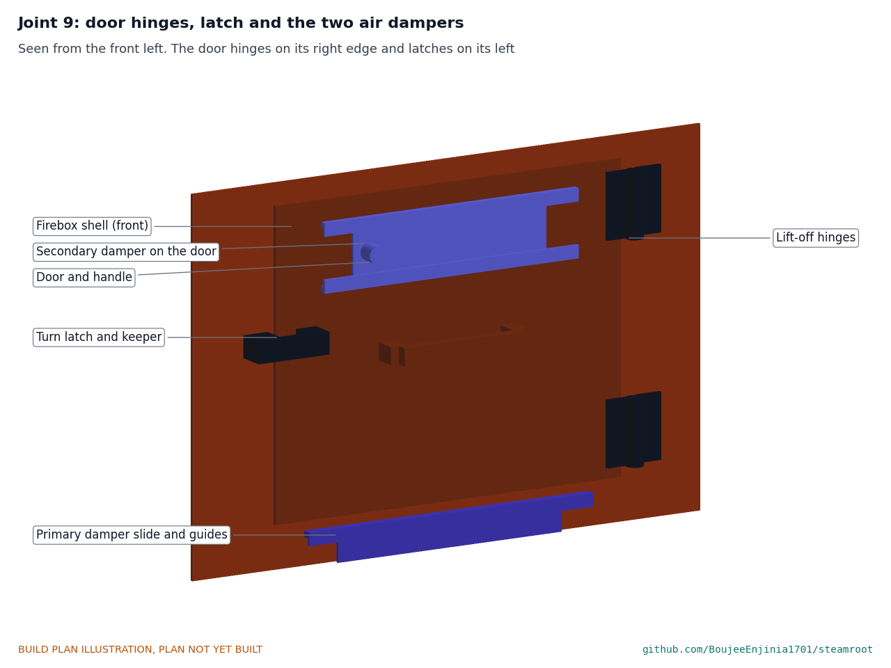

*Figure 11. The door hinges on its right edge and latches on its left. Below it, the primary air damper slides sideways between its guides; the secondary damper slides on the door itself.*

**Check before moving on.** The door shuts on the rope all round and latches; the plug clears the lining by about 4.

### 3.8 Primary air damper slide and guides

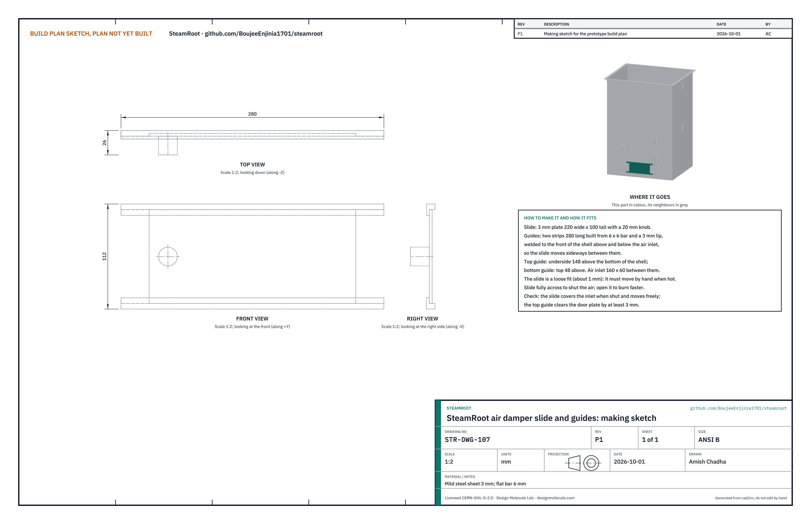

*Figure 12. Primary air damper slide and guides making sketch (STR-DWG-107).*

**What it is and what it is made from.** A plate that slides sideways over the air inlet under the grate to set how fast the fire burns. With the secondary damper on the door (section 3.27) it holds the excess air near 1.5, which the efficiency of section 3.25 depends on. Mild steel sheet 3 mm, 6 mm bar.

**How to make it.**

1. Cut the slide 220 wide x 100 tall from 3 mm sheet and weld a 20 mm knob near its left end.
2. Make two guides 280 long, each from a 6 x 6 bar welded to the shell and a 3 mm lip over it, so they form a channel the slide runs in.
3. Weld the guides to the front of the shell, centred on the air inlet: the top guide's underside 148 above the bottom of the shell, the bottom guide's top 48 above. Check the top guide clears the door plate by at least 3.

**How it fits the parts next to it.** The slide is a loose fit, about 1 mm, so it moves by hand when hot (Figure 11). Fully across, it shuts the air off.

**Check before moving on.** The slide covers the inlet when shut and moves freely.

### 3.9 Monotube coil

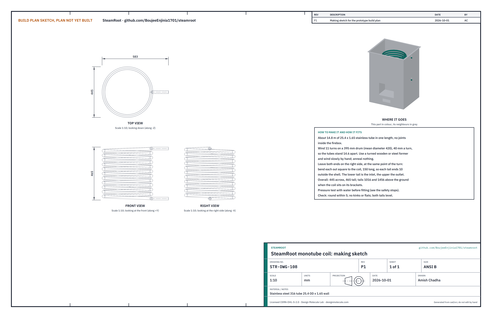

*Figure 13. Monotube coil making sketch (STR-DWG-108).*

**What it is and what it is made from.** The coil the water boils in, wound from one length of stainless steel 316 tube, 25.4 outside diameter, 1.65 wall, with no joint inside the firebox.

**How to make it.**

1. Make a former: a drum 395 in diameter and about 500 long, turned from timber or rolled from steel, with a slot to start the tube.
2. Leave 150 of straight tube at the start. Wind 10 turns by hand, slowly, keeping the turns 40 apart (14.6 between tubes) with spacer blocks. The mean diameter is 420.
3. Leave 150 of straight tube at the end. Bend each end out square to the coil on about a 75 radius, so both tails point the same way, one at the bottom and one at the top of the coil, and each ends 10 outside the shell when the coil is in place.
4. Slide the coil off the former. Check it is 445 across and 425 tall.
5. Fill it with water and pressure test it cold to 3 bar, the pump's shut-off pressure; hold 10 minutes with no fall and no leak.

**How it fits the parts next to it.** The coil rests on the three brackets (Figure 6). Its lower tail is the water inlet, 1016 above the ground; its upper tail is the steam outlet, 1416 above the ground. Both pass out through the slots in the right end (Figure 15).

**Check before moving on.** The coil is round within 5, with no kinks or flats, and both tails are level and parallel.

### 3.10 Tube gland plates (make 2)

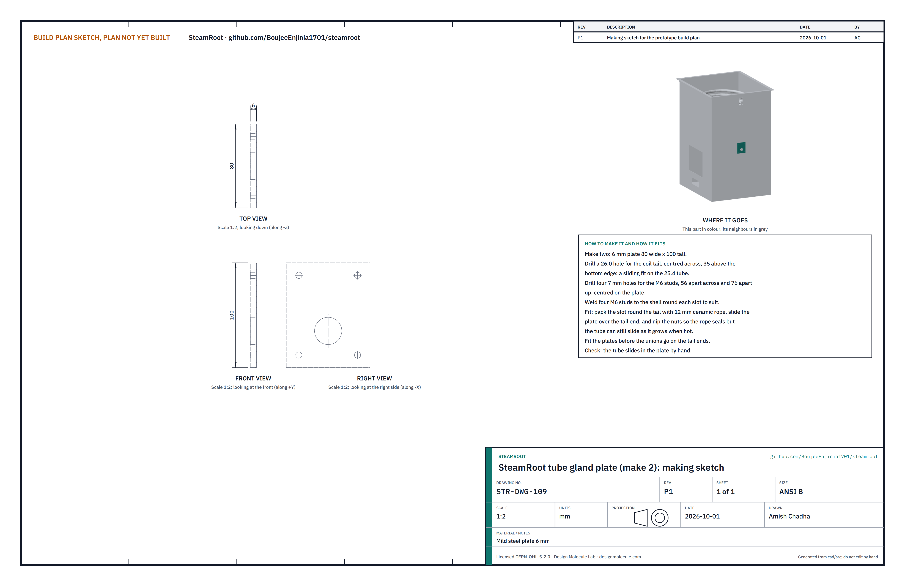

*Figure 14. Tube gland plate making sketch (STR-DWG-109).*

**What it is and what it is made from.** A plate that closes each tube slot round a coil tail and holds the rope packing that seals it, while letting the tube slide as it grows. Mild steel plate 6 mm.

**How to make it.**

1. Cut two plates 80 wide x 100 tall.
2. Drill a 26.0 hole for the tail, centred across, 35 above the bottom edge.
3. Drill four 7 mm holes for the studs, 56 apart across and 76 apart up and down, centred on the plate. Mark the four M6 studs on the shell through these holes and weld them on (section 3.2).

**How it fits the parts next to it.**

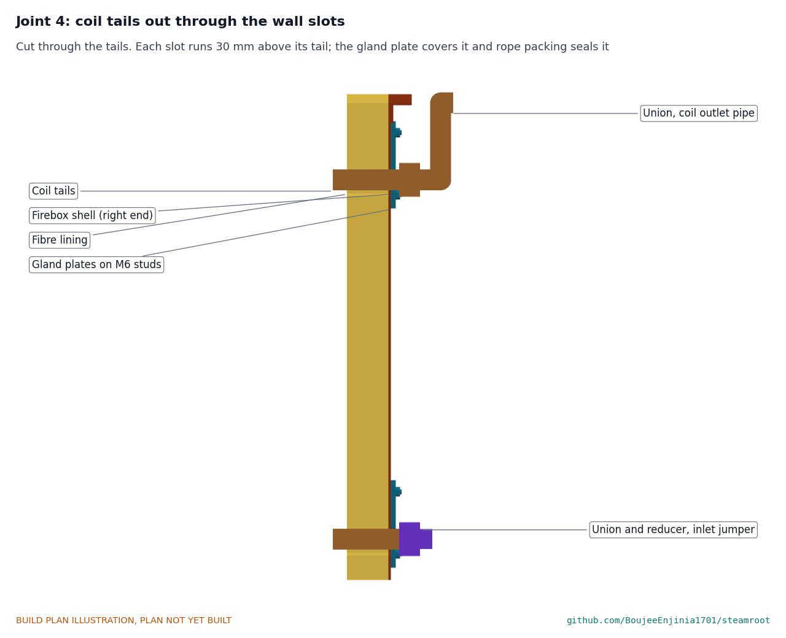

*Figure 15. Each slot runs 30 above its tail so the coil can go in high. Pack the slot round the tail with 12 mm ceramic rope, slide the plate over the tail end and nip the nuts. The unions go on afterwards.*

**Check before moving on.** Each tail slides in its plate by hand.

### 3.11 Firebox roof and roof board

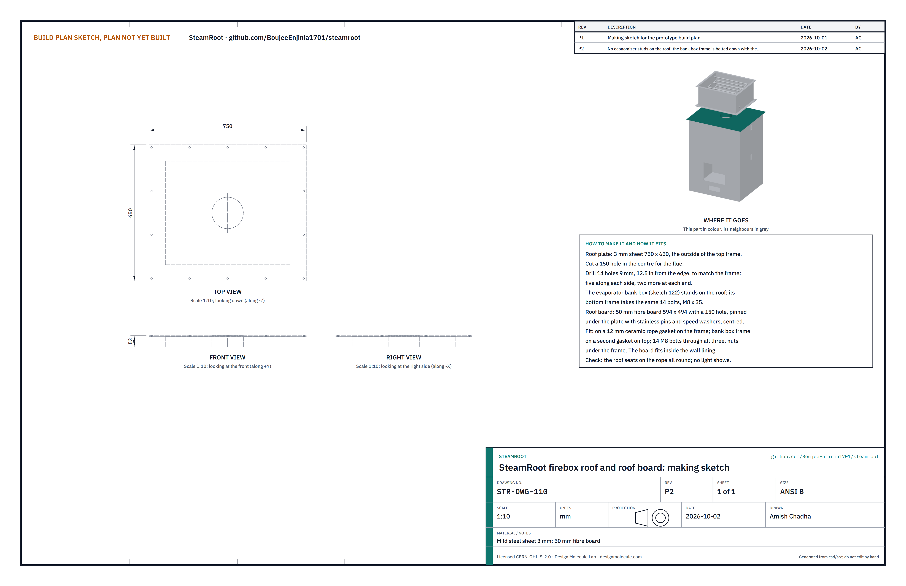

*Figure 16. Firebox roof making sketch (STR-DWG-110).*

**What it is and what it is made from.** The bolted lid of the firebox, lined underneath, which carries the evaporator bank box and, on that, the economizer. Mild steel sheet 3 mm and 50 mm fibre board.

**How to make it.**

1. Cut the plate 750 x 650 and a 150 hole in its centre.
2. Drill 14 holes of 9 mm to match the top frame (clamp the plate to the frame and drill through).
3. Pin the roof board (section 3.5) centred under the plate with stainless pins and speed washers, lining up the two 150 holes.

**How it fits the parts next to it.** It sits on a 12 mm ceramic rope gasket on the top frame. The bank box frame sits on a second gasket on top of it, and 14 M8 x 35 bolts clamp the bank box frame, the roof and the top frame together, nuts under the frame; the board fits inside the tops of the wall lining (Figure 18).

**Check before moving on.** The roof seats on the rope all round and no light shows between them.

### 3.12 Economizer box

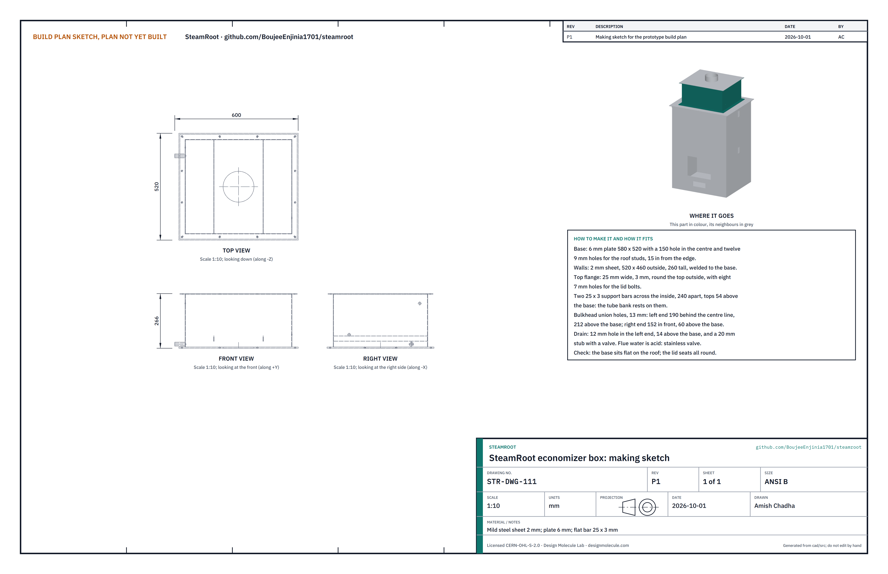

*Figure 17. Economizer box making sketch (STR-DWG-111).*

**What it is and what it is made from.** The box above the firebox that the hot flue gas rises through, around the tube bank that warms the feed water. Mild steel sheet 2 mm, 6 mm plate and 25 x 3 mm flat bar.

**How to make it.**

1. Cut the base 580 x 520 from 6 mm plate, with a 150 hole in the centre and twelve 9 mm holes 15 in from the edge for the roof studs.
2. Cut and weld the walls from 2 mm sheet, 520 x 460 outside and 260 tall, onto the base. Weld a 25 wide, 3 mm flange round the top outside, with eight 7 mm holes for the lid bolts.
3. Weld two 25 x 3 support bars across the inside, 240 apart, their tops 54 above the base.
4. Drill the two 13 mm holes for the bulkhead unions: in the left end 190 behind the centre line and 212 above the base; in the right end 152 in front and 60 above the base. Fit the unions.
5. Drill a 12 mm drain hole in the left end, 14 above the base, 150 behind the centre line, and fit a stainless drain valve. The condensate is acid.

**How it fits the parts next to it.**

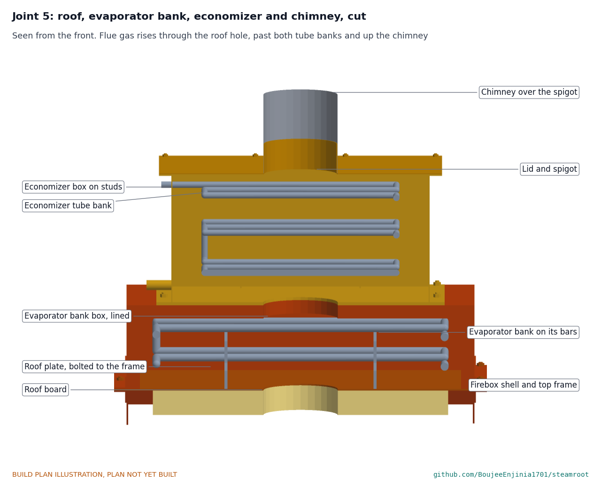

*Figure 18. Roof, economizer and chimney cut through the middle. The economizer base now sits on the evaporator bank box (section 3.25), over the twelve studs on its top plate, nuts on top. Flue gas rises through the roof hole, past the evaporator bank, through the economizer tube bank and up the chimney.*

**Check before moving on.** The base sits flat on the bank box; the support bars are level.

### 3.13 Economizer tube bank

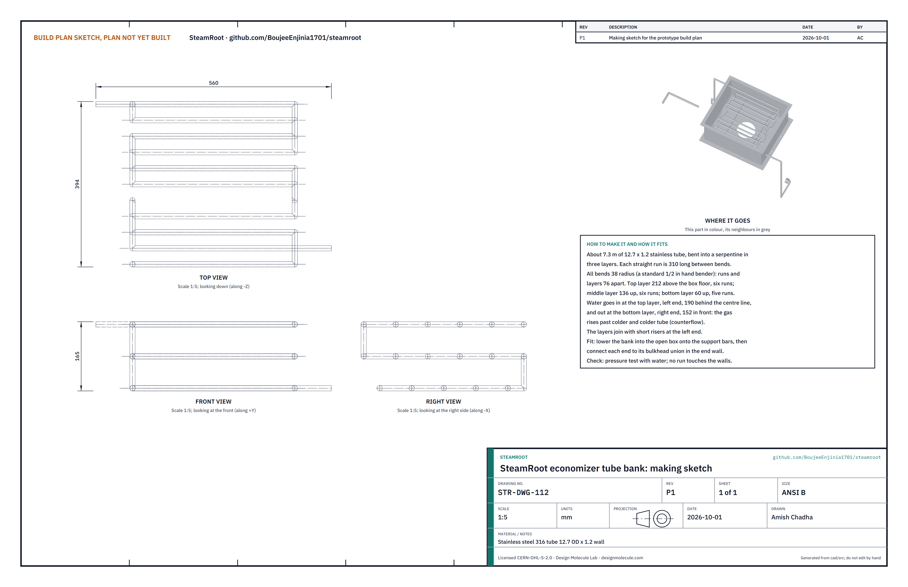

*Figure 19. Economizer tube bank making sketch (STR-DWG-112).*

**What it is and what it is made from.** The serpentine of stainless tube inside the economizer that the feed water flows through. About 7.3 m of stainless steel 316 tube, 12.7 outside diameter, 1.2 wall.

**How to make it.**

1. Bend the tube with a standard 1/2 in hand bender (38 radius), so the straight runs are 76 apart and each is 310 long between bends.
2. Top layer, 212 above the box floor: six runs, starting at the left end 190 behind the centre line. Turn down at the left end to the middle layer, 136 above the floor: six runs. Turn down again to the bottom layer, 60 above the floor: five runs, ending at the right end 152 in front of the centre line.
3. Leave a short straight at each end to meet the bulkhead unions.
4. Pressure test it cold to 3 bar for 10 minutes.

**How it fits the parts next to it.** Lower it into the open box onto the two support bars, then connect each end to its bulkhead union (step 10). Water enters at the top and leaves at the bottom, so the rising gas meets colder and colder tube.

**Check before moving on.** No run touches a wall; no leak at 3 bar.

### 3.14 Economizer lid

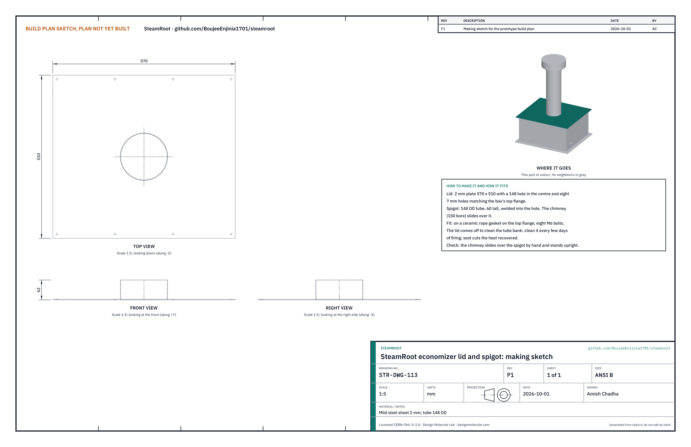

*Figure 20. Economizer lid and spigot making sketch (STR-DWG-113).*

**What it is and what it is made from.** The bolted top of the economizer, carrying the spigot the chimney stands on. Mild steel sheet 2 mm and a short length of 148 mm tube.

**How to make it.**

1. Cut the lid 570 x 510 with a 148 hole in the centre and eight 7 mm holes matching the box's top flange.
2. Weld a 148 outside diameter tube, 60 tall, upright into the hole.

**How it fits the parts next to it.** The lid sits on a rope gasket on the top flange under eight M6 bolts; the chimney (150 bore) slides over the spigot (Figure 18). Take the lid off to brush soot from the tube bank.

**Check before moving on.** The chimney slides over the spigot by hand and stands upright.

### 3.15 Header post

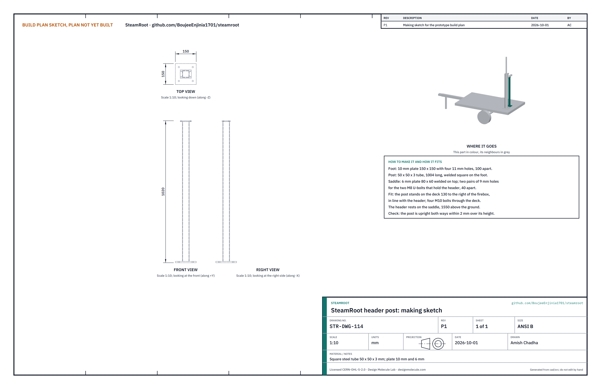

*Figure 21. Header post making sketch (STR-DWG-114).*

**What it is and what it is made from.** The post that carries the steam header 1550 above the ground. Square steel tube 50 x 50 x 3 mm, 10 mm and 6 mm plate, two M8 U-bolts.

**How to make it.**

1. Cut the foot 150 x 150 from 10 mm plate and drill four 11 mm holes 100 apart.
2. Cut the post 1004 long and weld it square on the centre of the foot.
3. Weld a 6 mm saddle plate 80 x 60 on top and drill two pairs of 9 mm holes for the U-bolts, 40 apart.

**How it fits the parts next to it.**

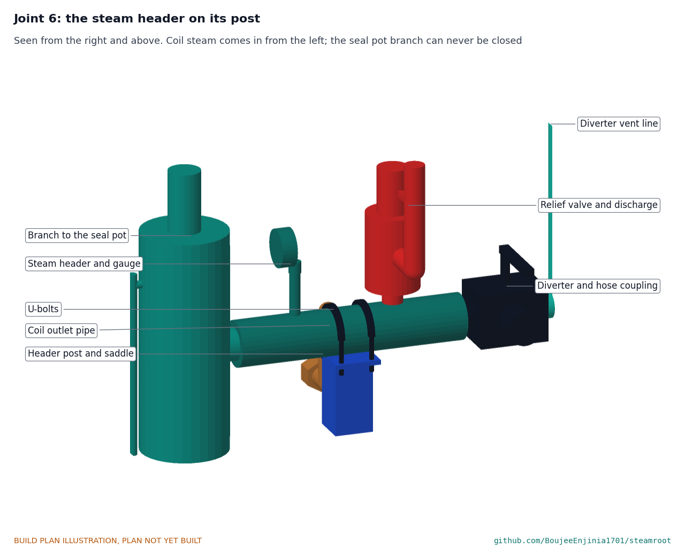

*Figure 22. The header lies on the saddle under two U-bolts. The coil outlet pipe enters its left side, the seal pot branch leaves its front end, the diverter its back end; the relief valve and gauge stand on top.*

The post stands on the deck 130 to the right of the firebox, on the centre line, held by four M10 bolts through the deck.

**Check before moving on.** The post is upright both ways within 2 over its height.

### 3.16 Steam header

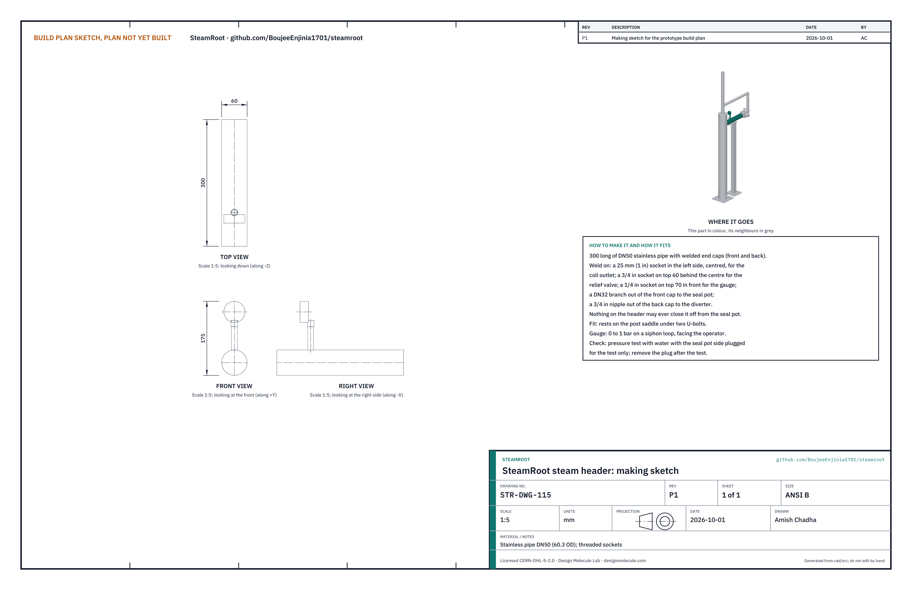

*Figure 23. Steam header making sketch (STR-DWG-115).*

**What it is and what it is made from.** A short, wide pipe that collects the steam from the coil and passes it to the seal pot, the relief valve, the gauge and the diverter. Stainless steel pipe DN50 (60.3 outside diameter), 300 long, with welded caps and sockets.

**How to make it.**

1. Cut 300 of DN50 pipe and weld a cap on each end.
2. Weld on: a 1 in socket in the left side, centred, for the coil outlet; a 3/4 in socket on top 60 behind the centre for the relief valve; a 1/4 in socket on top 70 in front of the centre for the gauge; a DN32 branch out of the front cap toward the seal pot; a 3/4 in nipple out of the back cap for the diverter.
3. Fit the gauge (0 to 1 bar) on a siphon loop, facing the front.

**How it fits the parts next to it.** See Figure 22. Nothing fitted to the header may ever close it off from the seal pot.

**Check before moving on.** Pressure test it cold to 3 bar with the seal pot branch plugged for the test only; remove the plug at once afterwards.

### 3.17 Water-seal pot, dip leg and vent

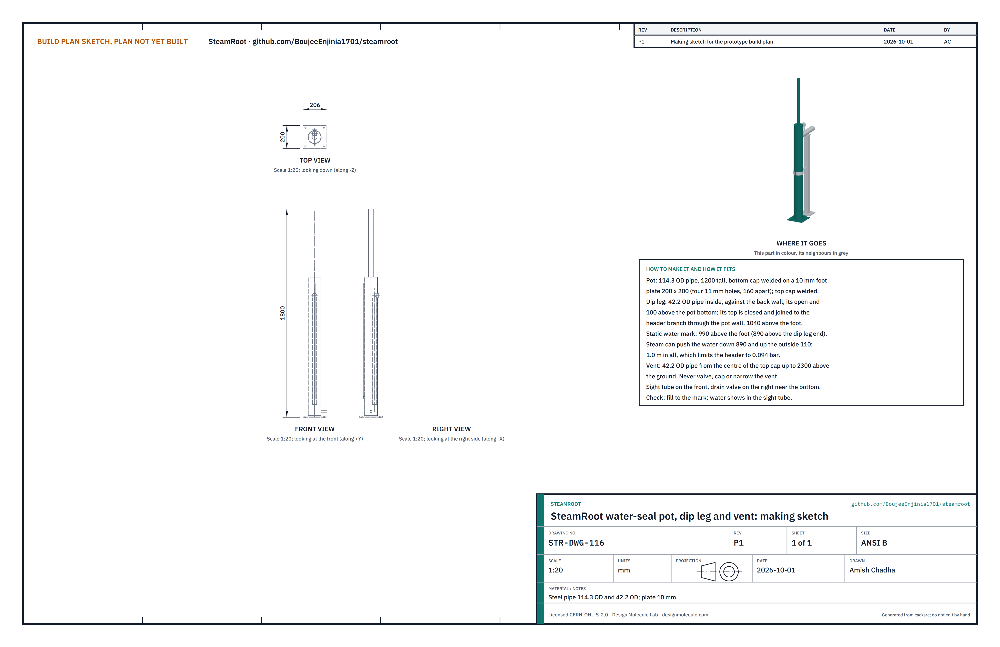

*Figure 24. Water-seal pot, dip leg and vent making sketch (STR-DWG-116).*

**What it is and what it is made from.** The pot of water that limits the steam pressure: steam from the header goes down a dip leg under the water, and if the pressure ever passes 0.084 bar it pushes the water out of the way and escapes up the vent. An overflow at the water mark keeps the pot from being overfilled, so the limit can never rise above that. Steel pipe 114.3 and 42.2 outside diameter, 10 mm plate, a 3/4 in half coupling.

**How to make it.**

1. Cut the pot 1200 long from 114.3 pipe; weld a cap on the bottom and stand it on a 10 mm foot plate 200 x 200 with four 11 mm holes 160 apart.
2. Cut the dip leg from 42.2 pipe, open at the bottom and closed at the top. Fit it inside the pot against the back wall, its open end 100 above the pot bottom, and join its top through the pot wall to the header branch, 1040 above the foot plate.
3. Weld the top cap on, and the vent pipe (42.2) up from its centre to 2300 above the ground.
4. Fit a level sight tube on the front, with the static water mark 990 above the foot plate (890 above the dip leg's open end), and a drain valve on the right near the bottom.
5. Weld a 3/4 in half coupling into the right side of the pot with the bottom of its bore at the water mark (its centre 1000 above the foot plate). The overflow pipe (section 3.28) screws into it.

**How it fits the parts next to it.**

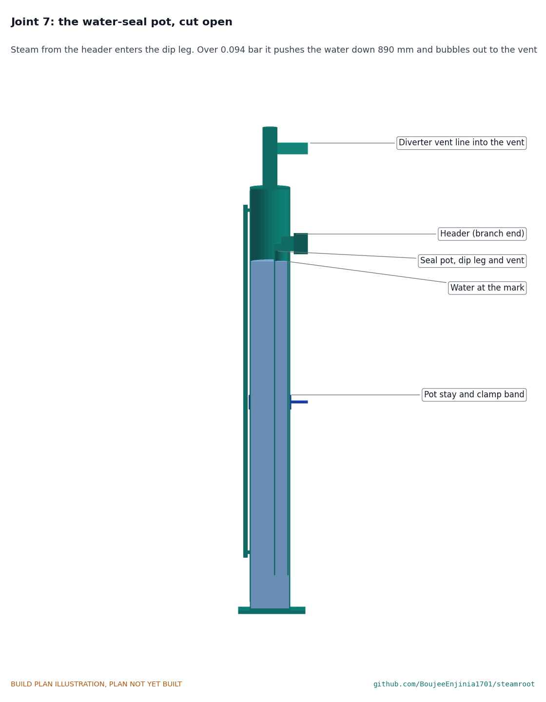

*Figure 25. The overflow holds the water at the mark: water pushed out of the dip leg runs away down the overflow instead of rising round it. So steam can push the water only 890 down the dip leg, 0.084 bar, before it bubbles through and leaves by the vent. The overflow's loop seal stops steam leaving that way. The diverter's vent line joins the vent above the pot.*

The pot stands on the deck in front of the header post, held by four M10 bolts and by the stay (section 3.18).

**Check before moving on.** Filled above the mark, the extra water runs out of the overflow at the ground and the level settles at the mark in the sight tube; the vent is open from end to end.

### 3.18 Pot stay

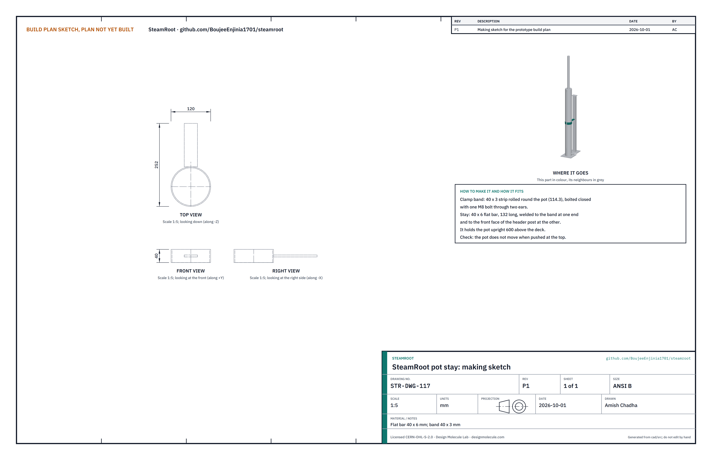

*Figure 26. Pot stay making sketch (STR-DWG-117).*

**What it is and what it is made from.** A short bar that ties the tall seal pot to the header post. Flat bar 40 x 6 mm and a 40 x 3 mm band.

**How to make it.**

1. Roll a 40 x 3 band round a piece of 114.3 pipe, with two ears for an M8 bolt.
2. Cut the stay 132 long from 40 x 6 bar and weld it to the band.

**How it fits the parts next to it.** Bolt the band round the pot 600 above the deck and weld the other end of the stay to the front of the post (Figure 22).

**Check before moving on.** The pot does not move when pushed at the top.

### 3.19 Drum saddles (make 2)

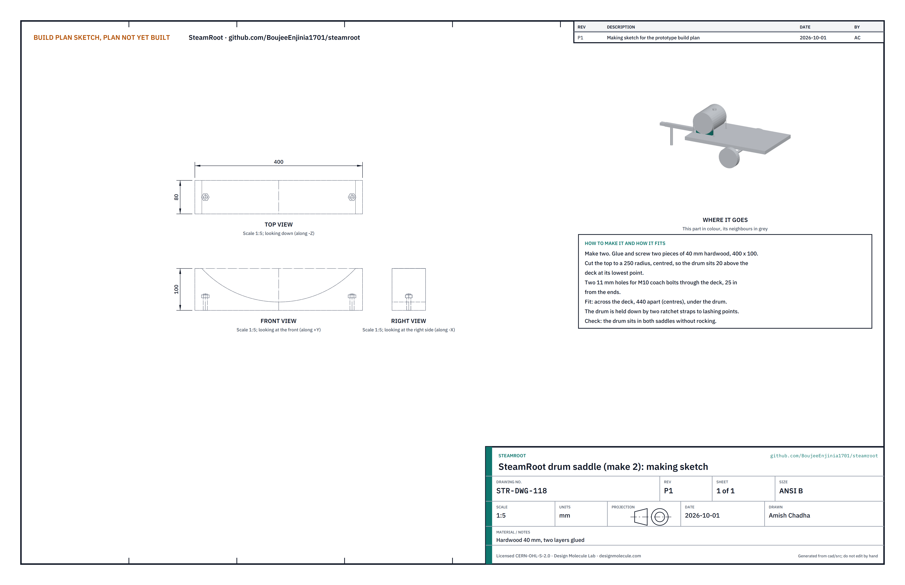

*Figure 27. Drum saddle making sketch (STR-DWG-118).*

**What it is and what it is made from.** Two curved blocks the feed drum lies in. Hardwood 40 mm, two layers glued and screwed.

**How to make it.**

1. Glue and screw two pieces of 40 mm hardwood, 400 x 100, for each saddle.
2. Cut the top to a 250 radius, centred, so the drum sits 20 above the deck at its lowest point.
3. Drill two 11 mm holes 25 in from the ends for M10 coach bolts.

**How it fits the parts next to it.**

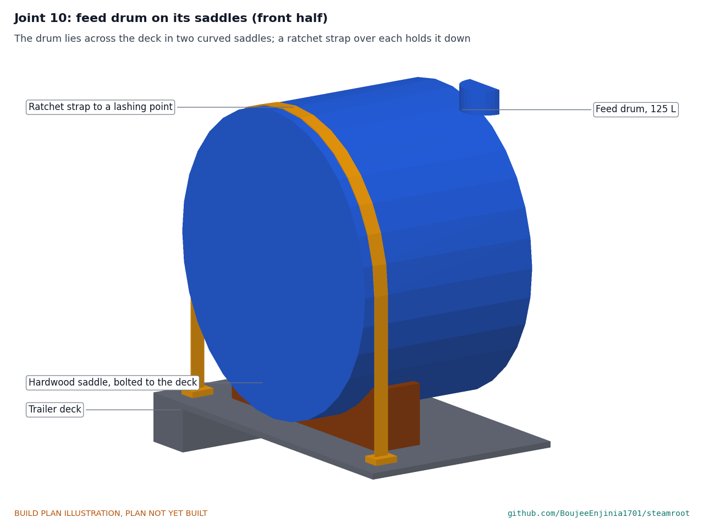

*Figure 28. The drum lies across the deck in the two saddles, 440 apart, held down by a ratchet strap over each to lashing points on the deck.*

**Check before moving on.** The drum sits in both saddles without rocking.

### 3.20 Hood shells (make 2)

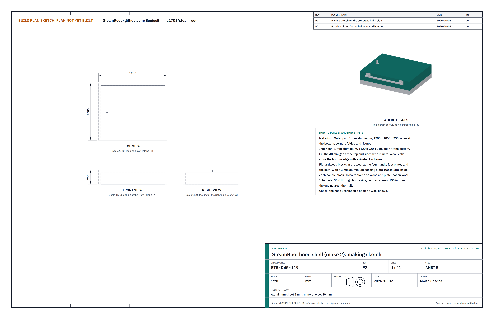

*Figure 29. Hood shell making sketch (STR-DWG-119).*

**What it is and what it is made from.** The insulated open-bottomed pan that is pressed onto the soil. Aluminium sheet 1 mm, two skins, with 40 mm mineral wool slab between them.

**How to make it.**

1. Fold the outer pan from 1 mm aluminium, 1200 x 1000 x 250, open at the bottom, corners folded and riveted.
2. Fold the inner pan, 1120 x 920 x 210, the same way.
3. Glue hardwood blocks to the inside of the outer pan where the four handle foot plates and the inlet will go, with a 3 mm aluminium backing plate, 100 square, on the inside of each handle block. The handles carry ballast weights (section 3.29), so their bolts must clamp on wood and plate, not on wool.
4. Lay 40 mm mineral wool slab in the outer pan, set the inner pan in, and close the bottom edge all round with a riveted aluminium U-channel.
5. Cut the inlet hole, 30.6 through both skins and the block, centred across, 150 in from the end nearest the trailer.

**How it fits the parts next to it.** The skirt, manifold and handles fit on it (Figure 32).

**Check before moving on.** The hood lies flat on a floor; no wool shows.

### 3.21 Hood skirts (make 2)

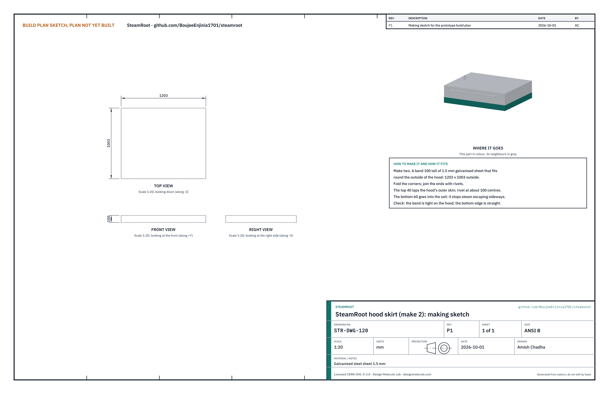

*Figure 30. Hood skirt making sketch (STR-DWG-120).*

**What it is and what it is made from.** A band round the bottom of the hood that goes 60 into the soil, so steam goes down, not sideways. Galvanised steel sheet 1.5 mm.

**How to make it.**

1. Cut a strip 100 wide and about 4420 long; fold the four corners so it fits round the hood, 1203 x 1003 outside.
2. Rivet the ends together.
3. Push it onto the hood so it laps the outer skin by 40, and rivet at about 100 centres. Do not weld galvanised steel.

**How it fits the parts next to it.** See Figure 32.

**Check before moving on.** The band is tight on the hood and its bottom edge is straight.

### 3.22 Hood manifolds (make 2)

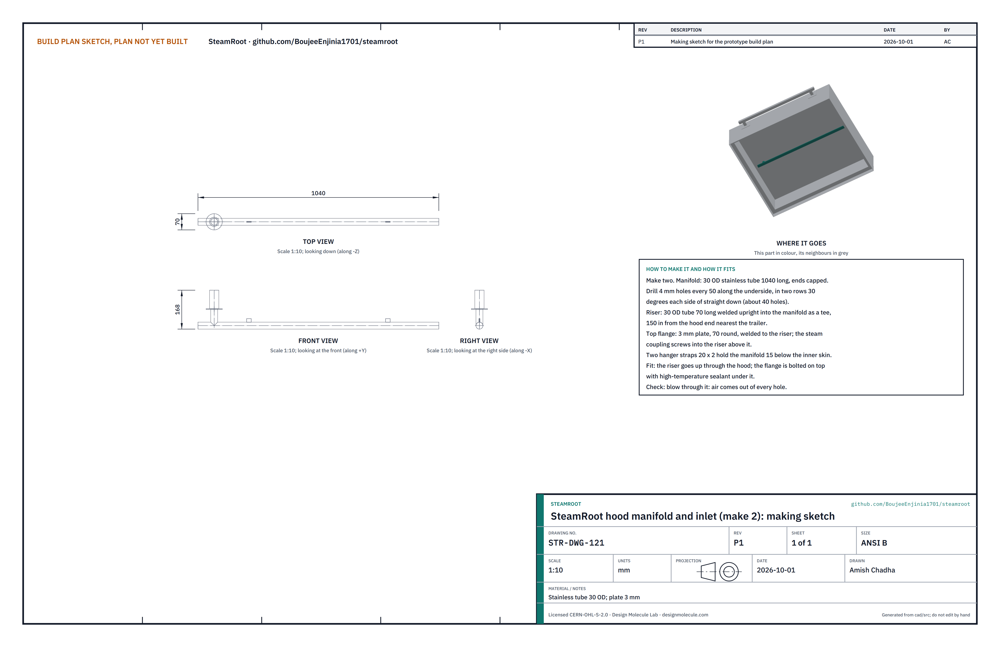

*Figure 31. Hood manifold and inlet making sketch (STR-DWG-121).*

**What it is and what it is made from.** The perforated pipe inside the hood that spreads the steam, with the riser and coupling the hose connects to. Stainless tube 30 outside diameter, 3 mm plate, a steam coupling.

**How to make it.**

1. Cut the manifold 1040 long and cap both ends.
2. Drill 4 mm holes every 50 along the underside, in two rows 30 degrees either side of straight down.
3. Weld a 70 long riser upright into the manifold as a tee, 150 from the end nearest the trailer, and a 70 round, 3 mm flange on the riser 70 above the manifold's centre line.
4. Screw the steam coupling into the top of the riser.

**How it fits the parts next to it.**

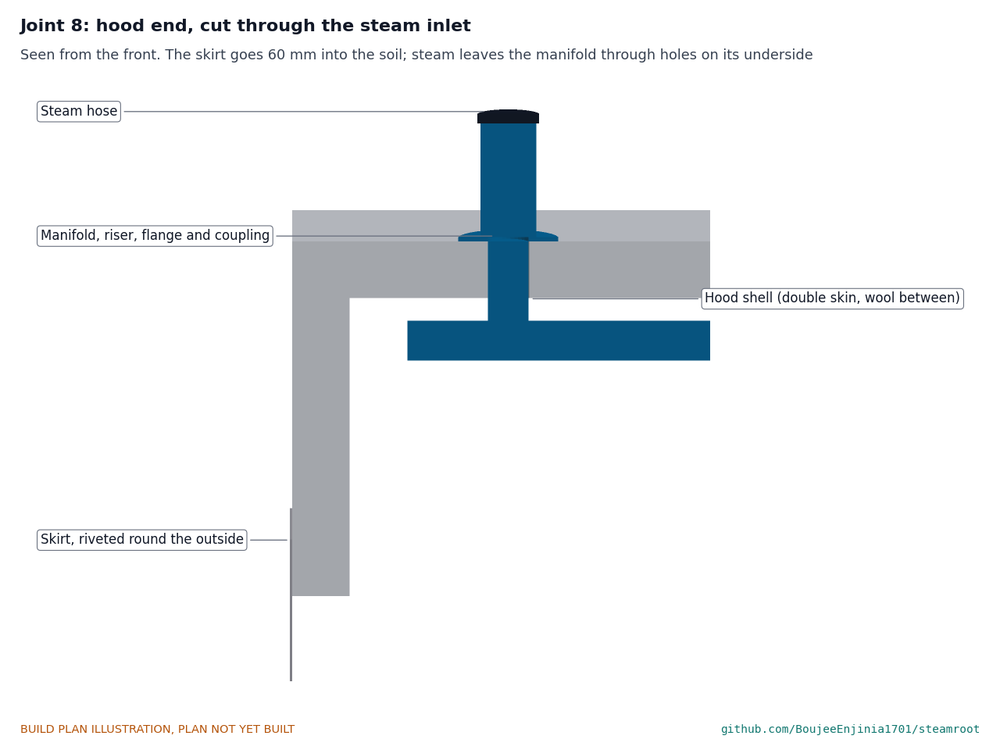

*Figure 32. The riser passes up through the hood; the flange is bolted down on high-temperature sealant; two straps hang the manifold 15 below the inner skin. The skirt laps the outside of the hood.*

**Check before moving on.** Blow through the coupling: air comes out of every hole.

### 3.23 Pump and alarm box and its wiring

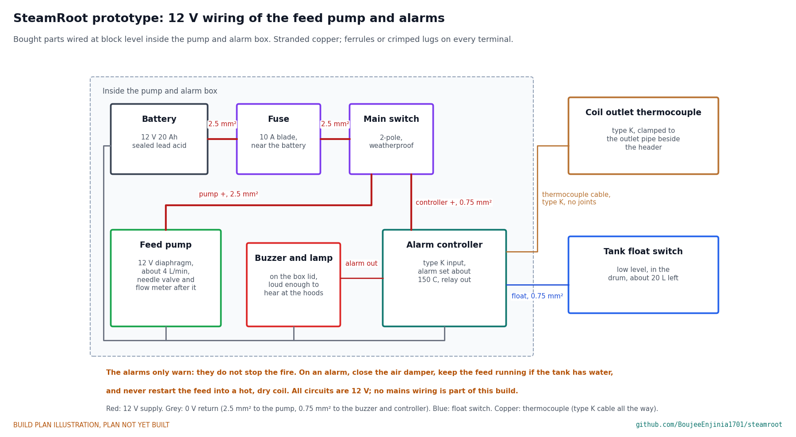

*Figure 33. Block-level wiring of the 12 V parts. All circuits are 12 V from a sealed lead acid battery; there is no mains wiring.*

**What it is.** A weatherproof box, about 240 x 250 x 240, bolted to the deck on the left of the firebox, holding the feed pump with its needle valve and flow meter, the 12 V battery, a fuse, the main switch and the alarm controller, with the buzzer and lamp on its lid.

**What to do to it.** Mount the parts on a board in the box and wire them as Figure 33 shows: battery through a 10 A fuse and the main switch to the pump and the controller in 2.5 mm² and 0.75 mm² wire; the type K thermocouple, clamped to the coil outlet pipe beside the header, back to the controller in type K cable with no joints; the drum's float switch to the controller; the controller's relay to the buzzer and lamp. Fit a cable gland for each cable that enters the box.

**Check before moving on.** With the main switch on, heating the thermocouple with a hot air gun sounds the alarm at about 150 °C, and lifting the float switch out of water sounds it too.

### 3.24 Bought components

Buy to specification, not brand. Line numbers are those of the bill of materials.

- **Trailer (line 1).** As section 3.1.
- **Feed drum (line 3).** 125 L HDPE drum with a bulkhead outlet and strainer near the bottom of one end, a filler cap and a level sight tube.
- **Feed pump (line 4).** 12 V diaphragm pump, about 4 L/min, shut-off pressure 3 bar or less, with a needle valve and a rotameter flow meter.
- **Lining, grate, door hardware (line 5).** Ceramic fibre blanket and board rated for 1260 °C with rigidizer; 300 x 300 cast grate; two weld-on lift-off hinges; a turn latch; 12 mm ceramic rope.
- **Chimney and spark arrestor (line 8).** 150 mm single-wall stainless flue about 0.5 m and a spark arrestor cap with mesh of 6 mm or finer.
- **Header and seal fittings (line 9).** DN50 stainless pipe and caps, sockets, 114.3 and 42.2 pipe, sight tube, drain valve; 3/4 in galvanised pipe, six elbows, a half coupling and a plug for the overflow; a three-way diverter valve rated for saturated steam that cannot stop with both outlets shut; a steam-rated quick coupling.
- **Relief valve (line 10).** Certified, code-stamped steam safety valve, 15 psi (1.03 bar) set, 3/4 in, rated 170 kg/h (375 lb/h) or more.
- **Steam hose (line 11).** EPDM saturated-steam hose, 25 bore, 6 m, ground-joint couplings and whip checks.
- **Battery (line 13), instruments (line 14), alarms (line 16).** As Figure 33; a 0 to 1 bar steam gauge with a siphon; four type K thermocouples and a reader.
- **Safety kit (line 15).** Personal carbon monoxide alarm, 2A:10B:C fire extinguisher, heat-resistant gloves, face shield.
- **Pipework and fittings (lines 19 and 20).** 3.9 m of 12.7 x 1.2 stainless tube for the feed line, the economizer to bank link and the coil inlet jumper; 1 m of 16 mm suction hose; stainless compression unions, a 25.4 to 12.7 reducer, two 15.88 to 12.7 reducing unions and two bulkhead unions; 3/4 in pipe and elbow for the relief discharge; 1 in pipe, two elbows and a tee for the diverter vent line.
- **Evaporator bank tube and lining (line 22).** About 7 m of 316 stainless tube, 15.88 x 1.24 (5/8 x 0.049 in); 25 mm ceramic fibre blanket and board for the bank box.
- **Fixings and straps (line 21).** 4 x M12 x 160 bolts; 12 x M10 bolts and coach bolts; 14 x M8 x 35 bolts; 2 x M8 bolts for the overflow clip; 2 x M5 screws for the bank slot cover; 16 x M6 bolts for the hood handles; 12 x M8 and 8 x M6 weld studs; 8 x M6 bolts; two M8 U-bolts for 60 mm pipe; nyloc nuts; two 25 mm ratchet straps with lashing points; 4 m of ceramic rope gasket.

### 3.25 Evaporator bank box

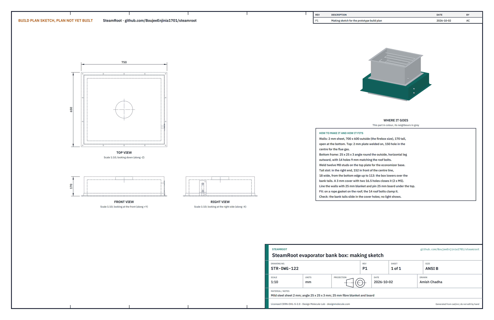

*Figure 34. Evaporator bank box making sketch (STR-DWG-122).*

**What it is and what it is made from.** A lined steel box that stands on the firebox roof and holds the evaporator bank in the hot gas leaving the firebox, before the gas reaches the economizer. It raises the fuel to steam efficiency from about 51 % to about 69 % with the dampers set (STR-CAL-001, section 4). Mild steel sheet 2 mm, 25 x 25 x 3 mm angle, 25 mm ceramic fibre blanket and board.

**How to make it.**

1. Fold or weld four walls of 2 mm sheet into an open box 700 x 600 outside (the size of the firebox) and 170 tall. Weld a 2 mm top plate on it with a 150 hole in the centre for the flue gas.
2. Weld a frame of 25 x 25 x 3 angle round the outside of the bottom edge, horizontal leg outward, and drill 14 holes of 9 mm in it to match the roof bolt holes (clamp it to the roof and drill through).
3. Weld twelve M8 studs on the top plate for the economizer base (mark them through the economizer base plate, section 3.12).
4. In the right end, cut a slot 18 wide from the bottom edge up to 113, centred 152 in front of the centre line, for the bank's two tails. Make a 3 mm cover plate with two 16.5 holes, 60 apart vertically, to close it, held by two M5 screws.
5. Line the walls with 25 mm blanket on stainless pins and pin 25 mm board under the top plate, cutting both round the slot and the flue hole.

**How it fits the parts next to it.** The bank sits on its bars on the roof first; the box is lowered over it, the tails passing up the slot, and the 14 roof bolts clamp its frame to the roof (Figure 35). The economizer stands on its top plate.

**Check before moving on.** The tails slide freely in the cover holes; with a lamp inside, no light shows at the frame or the slot.

### 3.26 Evaporator bank tube and supports

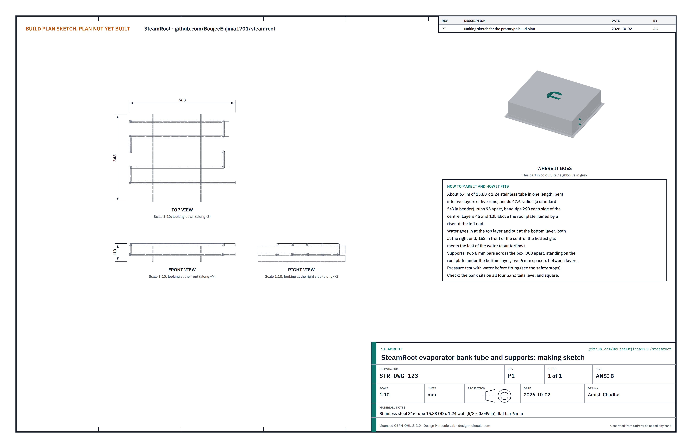

*Figure 35. Evaporator bank tube and supports making sketch (STR-DWG-123).*

**What it is and what it is made from.** A serpentine of stainless tube in which the feed water, warmed by the economizer, starts to boil before it goes down to the coil. About 6.4 m of stainless steel 316 tube, 15.88 outside diameter, 1.24 wall (5/8 x 0.049 in), and 6 mm flat bar.

**How to make it.**

1. Bend the tube in one length into two layers of five straight runs, with the bends at 47.6 radius (a standard 5/8 in hand bender), the runs 95 apart and the bend tips 290 each side of the centre. Join the layers with a riser at the left end.
2. Leave both ends straight at the right end, 152 in front of the centre line, one in the top layer (the inlet) and one in the bottom layer (the outlet), long enough to end 15 outside the box.
3. Cut two support bars from 6 mm flat bar, 546 long and 37 tall, and two spacers 546 long and 44 tall.
4. Pressure test the bank cold to 3 bar with water; hold 10 minutes with no fall and no leak.

**How it fits the parts next to it.** The two bars stand on the roof plate 300 apart across the box, the bottom layer rests on them, the spacers sit between the layers, and the top layer rests on the spacers. Water enters the top layer from the economizer and leaves the bottom layer for the coil, so the last of the water meets the hottest gas. A 15.88 to 12.7 reducing union on each tail joins the 12.7 link and jumper (step 18). Together the bank, coil, economizer and header hold about 7.3 L of water when flooded, inside the 8 L limit.

**Check before moving on.** The bank sits on all four bars without rocking; the tails are level and square to the wall.

### 3.27 Secondary air damper

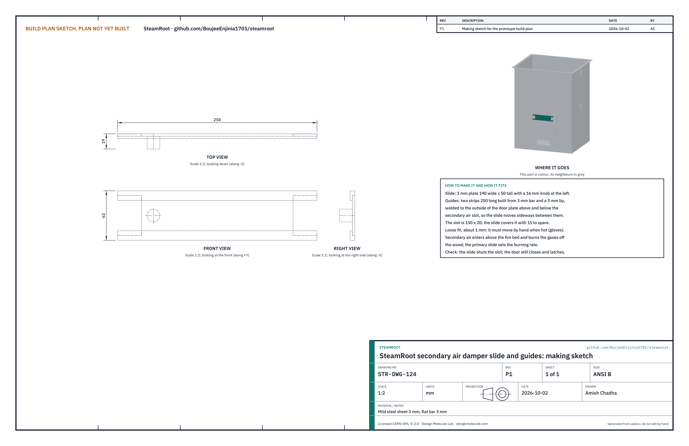

*Figure 36. Secondary air damper slide and guides making sketch (STR-DWG-124).*

**What it is and what it is made from.** A small slide on the door over the secondary air slot. Air let in above the fire bed burns the gases that come off the wood; with the primary damper it holds the excess air near 1.5. Mild steel sheet 3 mm and 3 mm bar.

**How to make it.**

1. Cut the slide 190 wide x 50 tall from 3 mm sheet and weld a 16 mm knob near its left end.
2. Make two guides 250 long from 3 mm bar with a 3 mm lip, and weld them to the outside of the door plate above and below the slot so the slide runs between them.

**How it fits the parts next to it.** The slide is a loose fit, about 1 mm, so it moves by hand when hot (Figure 11). It clears the latch and the upper hinge by at least 10.

**Check before moving on.** The slide shuts the slot and moves freely; the door still closes on its rope and latches.

### 3.28 Seal pot overflow and loop seal

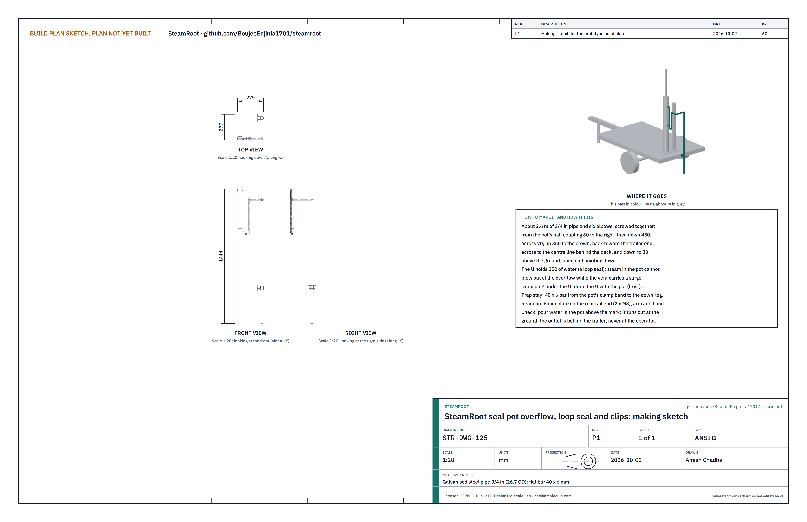

*Figure 37. Seal pot overflow, loop seal and clips making sketch (STR-DWG-125).*

**What it is and what it is made from.** A pipe that takes any water above the mark out of the seal pot and down to the ground behind the trailer, away from the operator's side, so the pot can never be overfilled and the seal limit can never rise. About 2.6 m of 3/4 in galvanised pipe, six elbows, a plug, 40 x 6 mm flat bar and a clamp band.

**How to make it.**

1. Screw the pipe together from the pot's half coupling: 60 to the right, down 450, across 70, up 350 to the crown, back toward the rear of the trailer, across to the centre line just behind the deck, and down to 80 above the ground with the open end pointing down.
2. The U between the down-leg and the up-leg holds 350 of water, a loop seal: it stops steam in the pot leaving by the overflow when the vent carries a surge (it holds about 3.3 kPa against about 2.4 kPa). Fit a drain plug under the U.
3. Make the trap stay from 40 x 6 bar, welded to the pot's clamp band and clamped to the down-leg, and the rear clip: a 6 mm plate bolted to the end of the rear rail with two M8 bolts, an arm and a band round the down-pipe.

**How it fits the parts next to it.** See Figure 25. The open end is behind the trailer, at least 1 m from the firebox door.

**Check before moving on.** Water poured into the pot above the mark runs out of the open end at the ground, and the U stays full.

### 3.29 Hood handles for ballast (make 2 sets)

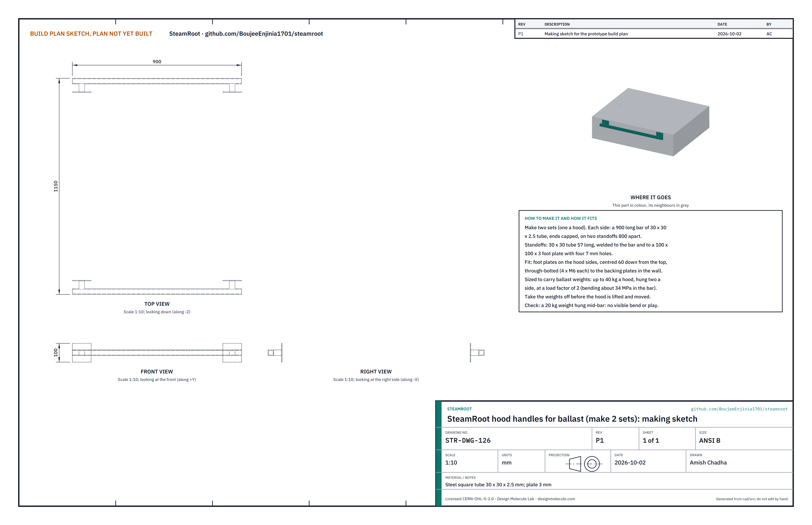

*Figure 38. Hood handles making sketch (STR-DWG-126).*

**What it is and what it is made from.** Two handles on each hood, strong enough to carry ballast weights that press the hood and its skirt onto the soil. Steel square tube 30 x 30 x 2.5 and 3 mm plate.

**How to make it.**

1. For each side, cut a 900 bar of 30 x 30 x 2.5 tube and cap its ends.
2. Weld two standoffs of 30 x 30 tube, 57 long, under the bar 800 apart, and weld each to a 100 x 100 x 3 foot plate with four 7 mm holes.

**How it fits the parts next to it.** The foot plates are bolted through the hood wall, the hardwood block and the backing plate (section 3.20) with four M6 bolts each, centred 60 below the top of the hood. Each hood's handles carry up to 40 kg of ballast, two weights a side, at a load factor of 2; the bar then sees about 34 MPa, a seventh of its yield strength. With 40 kg on, the hood presses on the soil with about 580 Pa and the header pressure rises only to about 0.036 bar. How much ballast is needed is found in the soil tests at TRL 4. Take the weights off before a hood is lifted.

**Check before moving on.** A 20 kg weight hung at the middle of a bar causes no visible bend or play.

## 4. Putting it together

In each picture the parts already fitted are grey and the part being fitted is in colour, with an arrow showing the way it goes in.

### Step 1: skids under the firebox shell

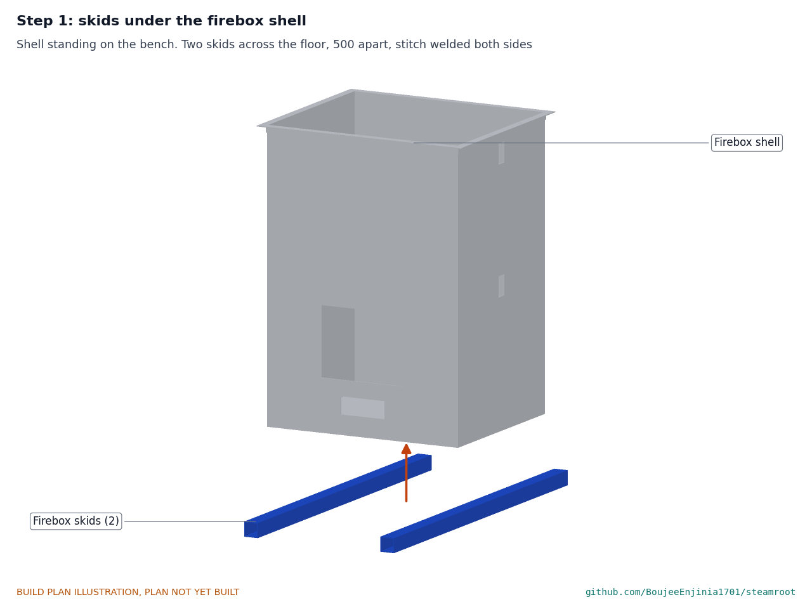

With the shell upside down on the bench, lay the two skids across the floor, 500 apart and 100 in from each end, and stitch weld them both sides (section 3.3).

### Step 2: weld on the brackets, guides and hinge leaves

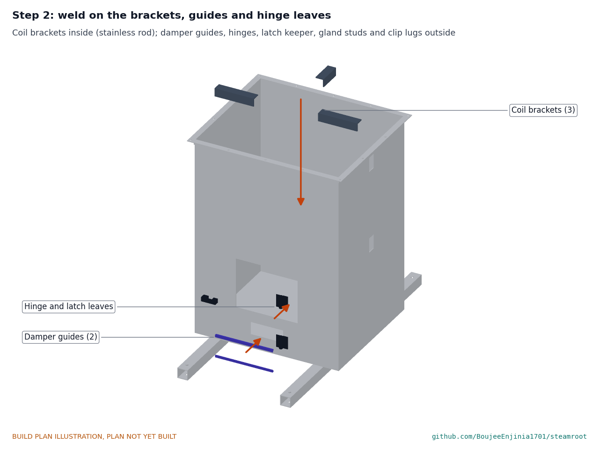

Weld the three coil brackets inside (section 3.4) and the damper guides, hinge leaves, latch keeper, gland studs and clip lugs outside (sections 3.2, 3.7, 3.8). **Hold point:** all welding on the shell is finished before the lining goes in.

### Step 3: firebox onto the trailer

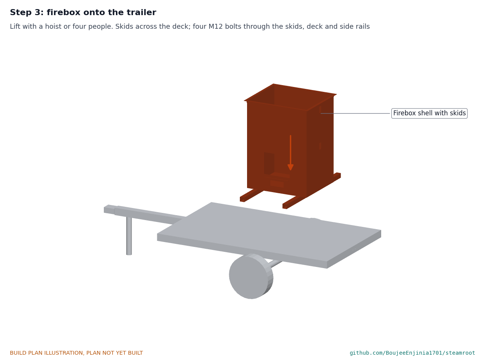

Lift the shell onto the deck with a hoist or four people, skids across the deck, the firebox centred on the deck's centre line with its right face 400 from the right end of the deck. Drill through the skid holes into the deck and side rails and fit four M12 bolts, nyloc nuts under the rails.

### Step 4: fibre lining into the firebox

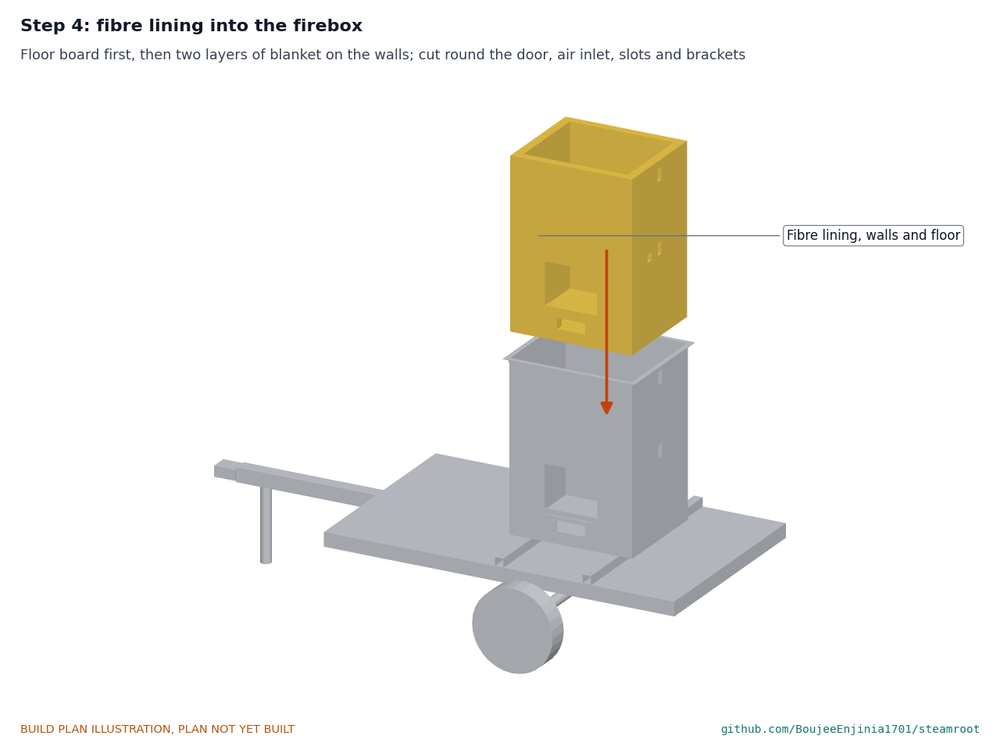

Floor board first, then the two layers of wall blanket over the pins, cut round the openings, slots and brackets (section 3.5). Wear the protective equipment in section 7.

### Step 5: grate stand and grate

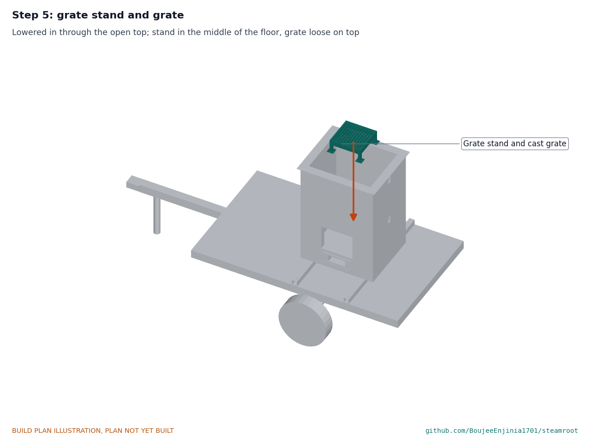

Lower the stand in through the open top onto the middle of the floor board and set the grate on it.

### Step 6: door and air dampers

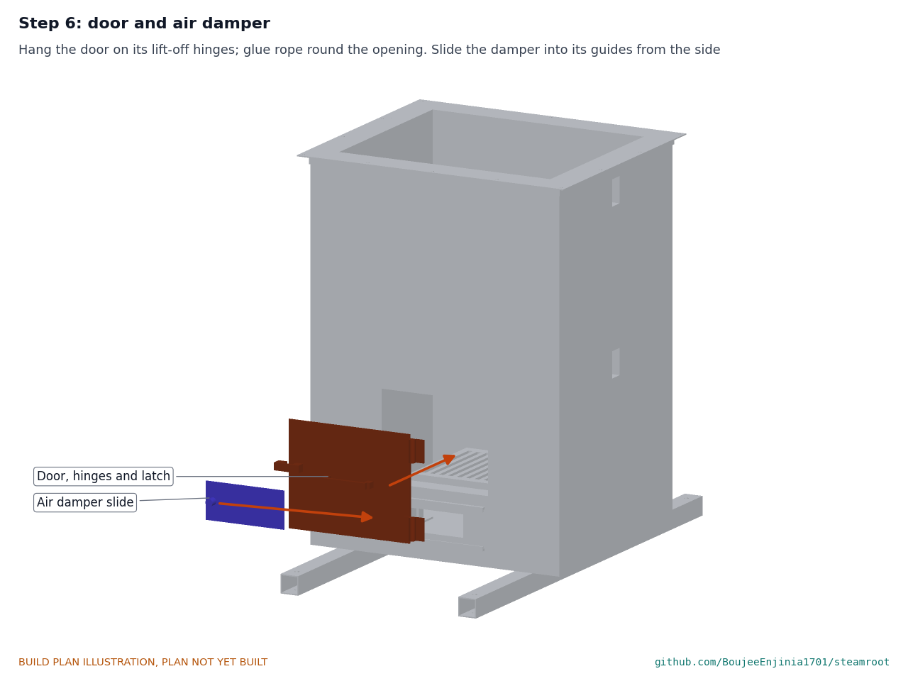

Lift the door onto its hinges and check it latches. Slide the primary damper into its guides on the shell and the secondary damper into its guides on the door, both from the side.

### Step 7: coil into the firebox

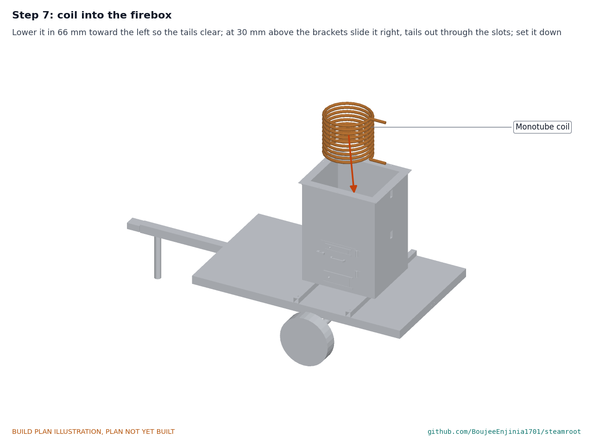

With a helper, lower the coil in through the open top with its tails toward the right end, held 66 toward the left and 30 above the brackets, so the tail ends clear the lining. Slide it to the right so the tails pass out through the slots, then set it down onto the three brackets. **Hold point:** the coil rests on all three brackets and both tails sit in the bottom of their slots; shim a bracket if needed.

### Step 8: gland plates over the coil tails

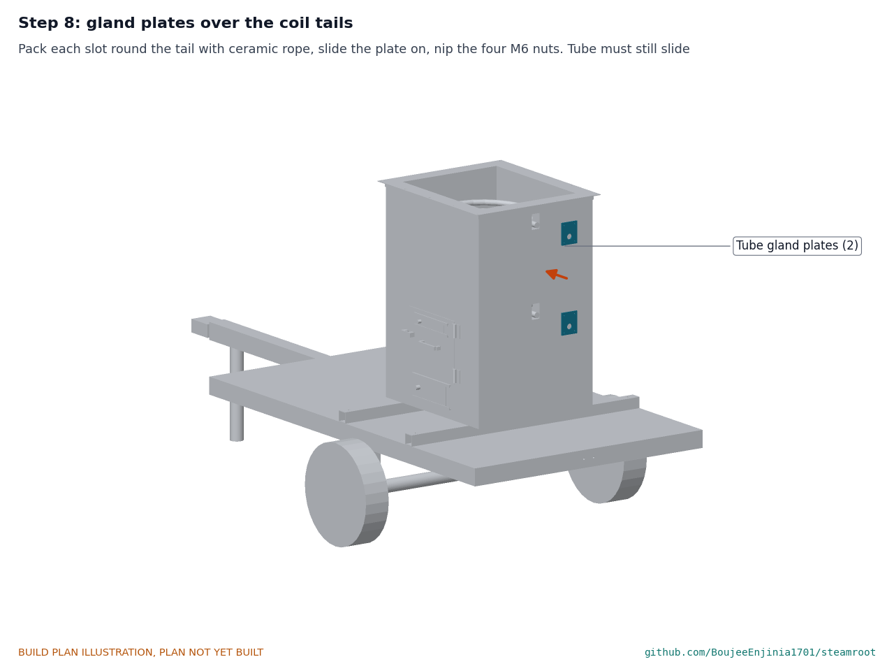

Pack each slot round its tail with ceramic rope, slide a gland plate over each tail end and nip the four M6 nuts so the rope seals but the tube still slides.

### Step 9: roof onto the firebox

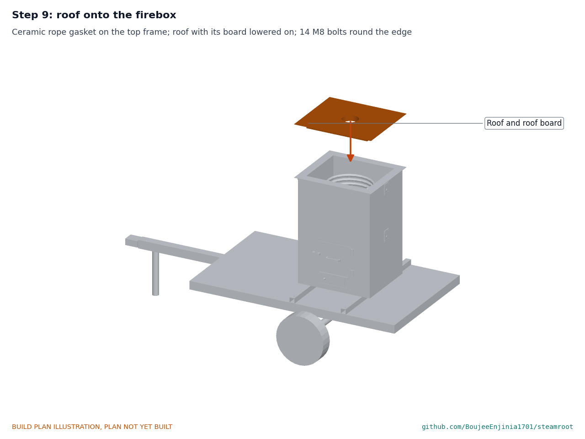

Lay ceramic rope on the top frame, lower the roof and board on, and fit the 14 M8 bolts, nuts under the frame, tightened evenly.

### Step 10: tube bank into the economizer box (on the bench)

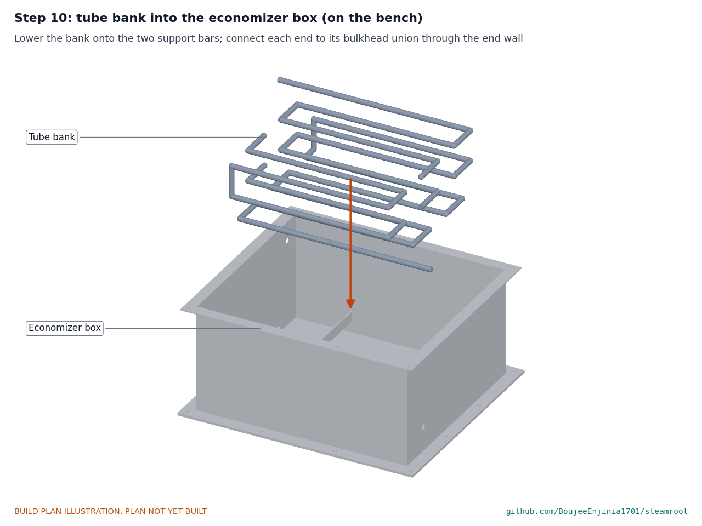

Lower the tube bank onto the two support bars and connect each end to its bulkhead union.

### Step 11: evaporator bank, economizer and lid onto the roof

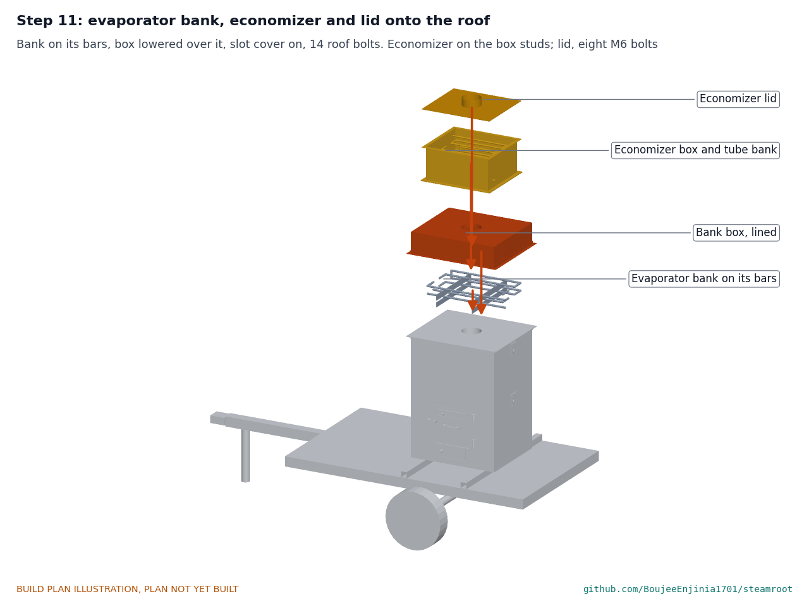

Stand the two support bars on the roof, set the bottom layer of the bank on them with its tails to the right, and fit the spacers. Lay rope gasket round the roof edge, lower the bank box over the bank so the tails come up the slot, and fit the slot cover. Fit the 14 M8 x 35 bolts through the box frame, roof and top frame, tightened evenly. Lay rope gasket on the box top round the flue hole, set the economizer over the twelve studs and fit the nuts. Lay rope on the top flange and bolt the lid on with eight M6 bolts.

### Step 12: chimney and spark arrestor

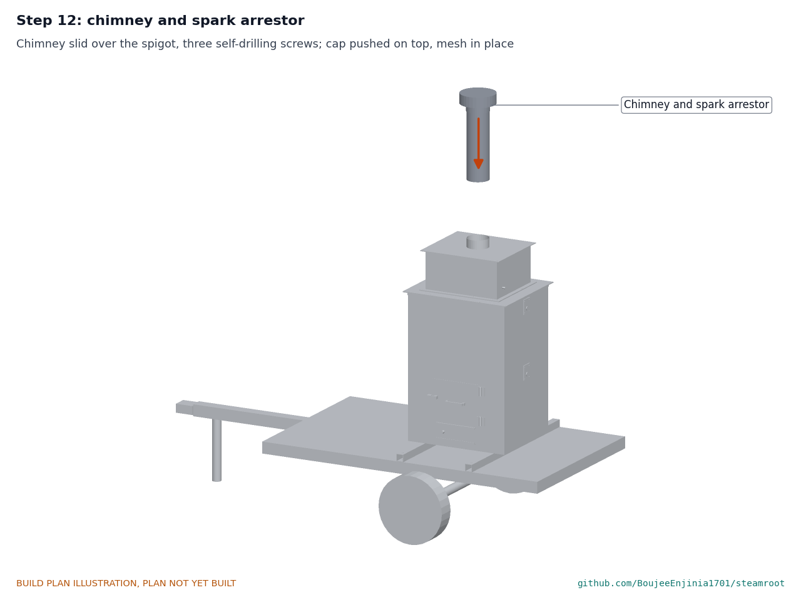

Slide the chimney over the spigot and fix it with three self-drilling screws; push the spark arrestor cap onto its top. Check the mesh is in place.

### Step 13: header post and header


Stand the post on the deck 130 right of the firebox on the centre line, mark and drill the deck, and fit four M10 bolts. Lay the header on the saddle, sockets as section 3.16, and fit the two U-bolts.

### Step 14: coil outlet pipe to the header


Bend the outlet pipe from 25.4 stainless tube to fit from the union on the upper tail to the header's side socket: out 25, up 94, across 40. Fit the union on the tail and screw the other end into the header. Tighten the union last, so nothing strains the coil.

### Step 15: water-seal pot, stay and overflow


Stand the pot on the deck in front of the post, its branch lined up with the header's front cap. Mark, drill and bolt its foot plate (four M10). Join the branch; bolt the stay's band round the pot and weld the stay to the post. Screw the overflow into the half coupling at the water mark, clamp the trap stay to the down-leg, and bolt the rear clip to the end of the rear rail round the down-pipe.

### Step 16: relief valve and diverter


Screw the relief valve upright into its socket on top of the header, lever toward the front, and fit the discharge pipe from its outlet up to 2.3 m with the stay to the vent pipe. Screw the diverter onto the header's back nipple with its hose coupling pointing right, and fit the vent line from its vent port up and into the vent pipe's tee. **Hold point:** safety stop S4.

### Step 17: feed drum on its saddles


Bolt the saddles across the deck, 440 apart, with M10 coach bolts. Lay the drum in them with its outlet toward the back, and fit the two ratchet straps to the lashing points.

### Step 18: pump box and feed lines


Bolt the pump and alarm box to the deck at the back edge, just right of the drum. Run the suction hose from the drum outlet to the pump. Bend the stainless feed line from the pump up the left end of the firebox, through its two clips, to the economizer inlet union. Bend the link from the economizer outlet union out and down to the bank's top tail, with a reducing union on the tail. Fit the reducer and union on the lower coil tail and bend the jumper up the right end to the reducing union on the bank's bottom tail. **Hold point:** safety stop S3.

### Step 19: build each hood (on the bench, make two)


With the hood upside down, hang the manifold from the inner skin on its two straps with the riser up through the inlet hole; bolt the flange down on sealant on top. Rivet the skirt round the outside. Bolt the handles' foot plates through the hood wall, the hardwood blocks and the backing plates.

### Step 20: steam hose to a hood


Couple the hose to the diverter and to the hood in use, and fit the whip checks at both ends. **Hold point:** safety stops S5 and S6.

## 5. First checks

These are the checks a TRL 4 test report would record; this plan only lists them. Requirement numbers are those of STR-REQ-001.

*Table 2. First checks.*

| Check | Requirement | How | Pass when |
| --- | --- | --- | --- |
| Open path to the vent | R6 | Cold, empty: with the diverter in each of its positions, blow low-pressure air into the bank inlet | Air always leaves by the vent or the hose; no position closes both |
| Seal limit | R6 | Pot filled to the mark with cold water; raise the header pressure slowly with air through a regulator; watch the gauge | Steam path opens (air bubbles through) at 0.08 to 0.09 bar; water above the mark leaves by the overflow; no water leaves the vent |
| Water in the heated section | R7 | Fill the coil, bank, economizer and header; drain and measure | 8 L or less (7.3 L calculated) |
| Leak test, steam side | R6, R7 | Cold water at 3 bar for 10 minutes, seal pot branch plugged for the test only | No leak, no pressure fall; plug removed |
| Feed rate | R3, R8 | Set the needle valve; time a measured volume at the coil inlet | 0.5 L/min (30 kg/h) |
| Alarms | Feed control (STR-DDR-001) | Heat the thermocouple with a hot air gun; lift the float switch | Alarm sounds at about 150 °C and at about 20 L left |
| Relief valve | R9 | Read the nameplate and code stamp; lift the test lever cold | 15 psi set; 170 kg/h or more; lever moves freely |
| Chimney and mesh | R10 | Measure the outlet height and the mesh | 2.2 m or more (2.4 m); mesh 6 mm or finer |
| Mass and width | R11 | Weigh on a weighbridge with the drum and pot drained; measure the width | 500 kg or less (499 kg estimated with both hoods aboard, 437 kg without); 1.5 m or less (1.48 m) |
| Steam output and pressure (first fire) | R3, R6 | With feed at 0.5 L/min, fire to steady steam at the hood; read the header gauge | Dry steam at the hood; header 0.1 bar or less |
| Hood handles | R10 | Contact thermometer on the handles and outer skin after 30 minutes of steaming | 60 °C or less |
| Run per fill | R8 | Time from a full drum to the low-level alarm | 3 h or more (4.2 h calculated) |
| Soil temperature | R1 | Type K probes at 15 cm under a hood | 70 °C or more for 20 to 30 minutes over 80 % of the footprint |

## 6. Safety stops

Stop at each point. Carry on only when everything listed is true.

- **S1. Before anything is bought or built.** A written ruling from the local boiler authority (the Texas Department of Licensing and Regulation's boiler program) on this open-vented, wood-fired monotube coil is in hand, and the design has been checked against it. Its ruling overrides this plan where it is stricter.
- **S2. Before welding, grinding or cutting fibre.** Hot work area clear of anything that burns, extinguisher at hand, welding screen up. Cut ceramic fibre with a knife, damp, never with a power saw; wear a P2 (FFP2) mask, gloves and long sleeves, and vacuum, never sweep. Never weld galvanised steel.
- **S3. Before any water goes into the coil, bank or economizer.** Every joint is made up; the coil, the evaporator bank and the economizer have passed their 3 bar cold tests; the seal pot branch is open (no test plug left in).
- **S4. Before the seal pot is put in service.** The vent is open from the pot to its outlet at 2.3 m; the diverter cannot stop with both outlets shut; nothing on the steam side can isolate the coil from the vent; the relief valve is fitted upright with its discharge pipe open to 2.3 m; the pot is free of ice and filled to the mark; the overflow is clear to its open end behind the trailer, its loop seal is full of water, and no one stands near its outlet.
- **S5. Before the first fire.** All first checks up to "Run per fill" in section 5 pass, except the ones that need fire. The machine stands on bare ground or gravel, clear of dry vegetation, outdoors, with no fire ban and no high wind. Extinguisher and water at hand; the operator wears a personal carbon monoxide alarm, heat-resistant gloves, a face shield, long sleeves and closed boots; bystanders, children and animals at least 5 m away. The feed pump is running and water flows before the fire is lit: never fire a dry coil.
- **S6. Before steam goes to a hood.** The diverter is set to the vent; the hose and whip checks are inspected; the hood is set on the soil with its skirt pressed in. Keep hands and feet clear of the skirt and the vent outlet.
- **S7. Before lifting a hood or moving the hose.** Steam has been diverted to the vent for at least one minute.
- **S8. After any alarm.** Close both air dampers. Never restart the feed into a hot, dry coil: let the fire die and the coil cool first.
- **S9. Before towing.** The fire is out and cold; the drum and seal pot are drained; the hoods are off the trailer and ride on a second vehicle; the lights work.
- **S10. After every day of use and whenever frost is forecast.** The seal pot is drained through its valve and the overflow's loop seal through its plug.

## 7. Tools, skills and workspace

**Tools.** MIG welder for 2 to 3 mm mild steel; stick or TIG welder with 309 rod for the stainless brackets and 316 rod for the stainless header; angle grinder with cutting, grinding and flap discs; plasma cutter or jigsaw with metal blades for sheet; bench drill and drills to 13 mm; step drill; 150 mm hole saw or plasma for the flue holes; sheet metal folder (or clamped angle and mallet) for the 1 mm hoods and the 1.5 mm skirts; pop rivet tool; hand tube benders for 1/2 in tube, 38 mm radius, and 5/8 in tube, 47.6 mm radius; a 395 mm coil former and spacer blocks; pipe wrenches, spanners and a torque wrench; thread sealant rated for steam; utility knife for the fibre; tape measure, square, level and spirit level; hydraulic hand pump and gauge to 4 bar for the cold tests; multimeter; hot air gun; a hoist or four people for lifting the firebox.

**Skills.** Welding mild steel sheet and tube to a sound, leak-free standard, and stainless to mild steel; bending tube without kinks; threaded and compression pipe fitting; folding and riveting sheet; 12 V wiring. Steam pipework must be fitted by someone who has done it before or is supervised by someone who has. No mains wiring is part of this build.

**Workspace.** A fabrication workshop with a concrete floor and room for the trailer and a 2 x 1 m bench; a separate bench for the hoods; good ventilation for welding; a wet area for the cold pressure tests. First fire outdoors only, on bare ground or gravel.

**Personal protective equipment.** Welding helmet, gloves and jacket; safety glasses and hearing protection for grinding and cutting; P2 (FFP2) mask, gloves and long sleeves for ceramic fibre and mineral wool; heat-resistant gloves, face shield, long sleeves and closed boots for any work near a fire or steam; a personal carbon monoxide alarm at any fire.

## 8. Where the numbers come from

- Model and constructability checks: `cad/src/model.py` (`python cad/src/model.py --check`, 124 checks); STEP and STL exports in `cad/step/` and `cad/stl/`.
- Pictures: `cad/src/build_plan_media.py`, using `.kit/build_views.py`; written to `docs/05-build-plan/` and `cad/drawings/STR-DWG-101` to `STR-DWG-126`.
- General arrangement: `cad/drawings/STR-DWG-002.pdf`, Rev P4.
- Calculations: `docs/04-calcs/01-sizing.md` (STR-CAL-001 v0.4) and `docs/04-calcs/sizing.py`; evaporator bank and dampers section 4, masses section 7, pressures and seal section 5, stored water and the overflow section 6.
- Bill of materials: `bom/bom.csv`.
- Decisions: `docs/decisions/0003-design-for-construction.md` (STR-DDR-003), with STR-DDR-001 and STR-DDR-002; open decisions in `docs/06-design-decisions.md` (STR-DEC-001).
- Requirements: `docs/03-requirements.md` (STR-REQ-001 v0.7).
